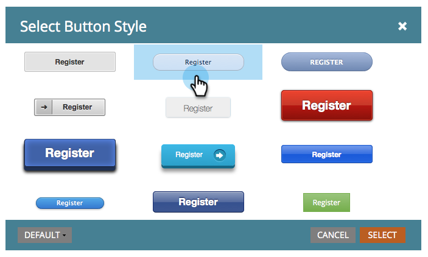
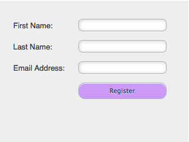

# Cambiar el estilo y el color del botón Enviar {#change-submit-button-style-and-color}

Si encuentra el botón de envío estándar aburrido o si necesita algo más elegante, no dude en elegir entre una amplia gama de estilos de botones listos para usar.

1. Vaya a **[!UICONTROL Actividades de marketing]**.

   

1. Seleccione el formulario y haga clic en **[!UICONTROL Editar formulario]**.

   

1. Seleccione el botón **[!UICONTROL Enviar]** y haga clic en **[!UICONTROL Editar]** junto a Estilo de botón.

   

   >[!TIP]
   >
   >Puede arrastrar el botón de envío a la izquierda o a la derecha para cambiar su posición.

1. Elija el estilo de botón que desee (desplácese hacia arriba/abajo).

   

1. Puede dejar el color como predeterminado o personalizarlo.

   

   >[!TIP]
   >
   >También puede introducir el código de color manualmente.

1. Haga clic en **[!UICONTROL Seleccionar]**.

   

1. Haga clic en **[!UICONTROL Finalizar]**.

   

1. Haga clic en **[!UICONTROL Aprobar y cerrar]**.

   

   

   >[!NOTE]
   >
   >Al igual que muchos elementos gráficos, el botón puede tener un aspecto diferente en función del explorador que utilice.
