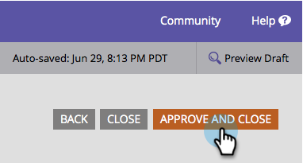

# Cambiar estilo y color del botón Enviar {#change-submit-button-style-and-color}

Si encuentra el botón de envío estándar apagado, o si necesita algo más sofisticado, no dude en elegir entre una amplia gama de estilos de botón listos para usar.

1. Vaya a **Marketing** **Actividades**.

   

1. Seleccione el formulario y haga clic en **Editar** **formulario**.

   

1. Seleccione el botón **Enviar** y haga clic en **Editar** junto a Estilo de botón.

   

   >[!TIP]
   >
   >¿Sabía que puede arrastrar el botón de envío a la izquierda o a la derecha para cambiar su posición? Es así de fácil. ¡Pruébelo!

1. Elija el estilo de botón que desee (desplácese hacia arriba o hacia abajo).

   

1. Puede dejar el color como predeterminado o personalizarlo.

   

   >[!TIP]
   >
   >También puede introducir el código de color manualmente.

1. Haga clic en **Seleccionar**.

   

1. Haga clic en **Finalizar**.

   

1. Haga clic en **Aprobar y cerrar**.

   

   ¡Ahí vas!

   

   >[!NOTE]
   >
   >Al igual que muchos elementos gráficos, el botón puede tener un aspecto diferente según el navegador que utilice.

