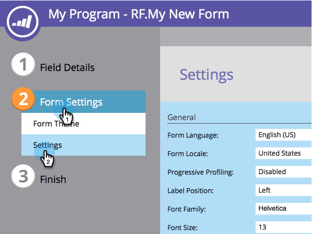

# Cambio de la familia de fuentes del formulario {#change-the-form-font-family}

Google Fonts está integrado en el editor de formularios.

>[!NOTE]
>
>Esta configuración afecta a la etiqueta del formulario, el texto de entrada y cualquier texto enriquecido.

1. Vaya a **[!UICONTROL Actividades de marketing]**.

   

1. Seleccione el formulario y haga clic en **[!UICONTROL Editar formulario]**.

   

1. En **[!UICONTROL Configuración de formulario]**, seleccione **[!UICONTROL Configuración]**.

   

1. Seleccione la **[!UICONTROL familia de fuentes]** que desee.

   >[!TIP]
   >
   >Hay un montón de [Google Fonts](https://fonts.google.com/){target="_blank"} disponibles para usar.

   

1. Haga clic en **[!UICONTROL Finalizar]**.

   

1. Haga clic en **[!UICONTROL Aprobar y cerrar]**.

   >[!NOTE]
   >
   >El formulario debe aprobarse para poder utilizarse en páginas de aterrizaje.

   

   >[!NOTE]
   >
   >Recuerde aprobar los cambios del borrador de la página de aterrizaje creado por el formulario.

   

>[!MORELIKETHIS]
>
>[Cambiar el tamaño de fuente del formulario](/help/marketo/product-docs/demand-generation/forms/form-design/change-the-form-font-size.md)
