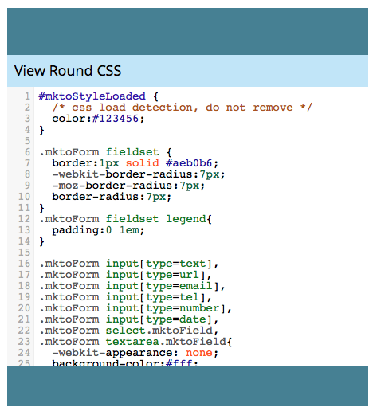
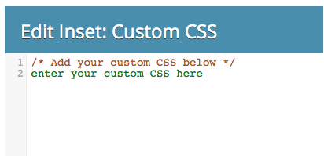
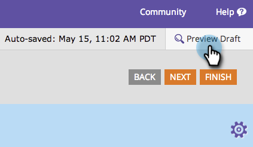

# Editar la CSS de un tema del formulario {#edit-the-css-of-a-form-theme}

Tiene algunos precompilados [temas de los que puede elegir](/help/marketo/product-docs/demand-generation/forms/creating-a-form/select-a-form-theme.md). Pero si le encanta editar CSS, puede realizar cualquier cambio que desee. Así es como.

>[!NOTE]
>
>Asegúrese de conocer CSS si desea probar esto, ya que la compatibilidad con Marketo no está configurada para ayudarle con la codificación personalizada. Además, los cambios realizados solo se aplicarán al formulario que esté editando.

1. Vaya a **Actividades de marketing**.

   

1. Seleccione el formulario y haga clic en **Editar formulario**.

   

1. Vaya a **Configuración de formulario**.

   

1. Seleccione el tema al que desee realizar cambios.

   

1. Bajo el icono de engranaje, haga clic en **Ver tema CSS**.

   

1. Siéntase libre de cortar/pegar esta CSS en su propio editor. Es de solo lectura, por lo que solo necesitará la CSS anulada.

   

1. Haga clic en **Cerrar**.

   

1. Bajo el icono de engranaje, haga clic en **Editar CSS personalizada**.

   

1. Introduzca su CSS personalizada. No se necesita todo, solo las partes que son diferentes.

   

1. Cuando haya terminado, haga clic en **Guardar**.

   

1. Para ver el formulario personalizado, haga clic en **Previsualizar borrador**.

   

¡Y eso es todo!
