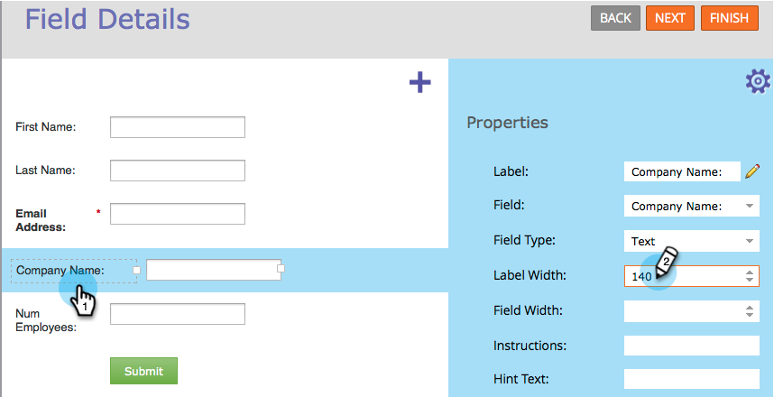

# Cambiar el tamaño de la etiqueta o el ancho del campo en un formulario {#resize-label-field-width-in-a-form}

Existen dos formas de cambiar el tamaño del ancho de etiqueta del campo y del propio ancho del campo.

## Arrastre y suelte la anchura {#drag-and-drop-the-width}

1. En [editor de formularios](/help/marketo/product-docs/demand-generation/forms/form-actions/edit-a-form.md), seleccione el campo cuyo tamaño desee cambiar.

   

1. Arrastre la esquina de la etiqueta o la esquina del campo para cambiar el tamaño.

   

## Introduzca la anchura manualmente {#enter-the-width-manually}

1. Seleccione el campo cuyo tamaño desee cambiar.

   

1. Escriba un valor en píxeles para [!UICONTROL Anchura de etiqueta] y/o [!UICONTROL Anchura de campo].

   

¡Buen trabajo! Bastante fácil, ¿verdad?
