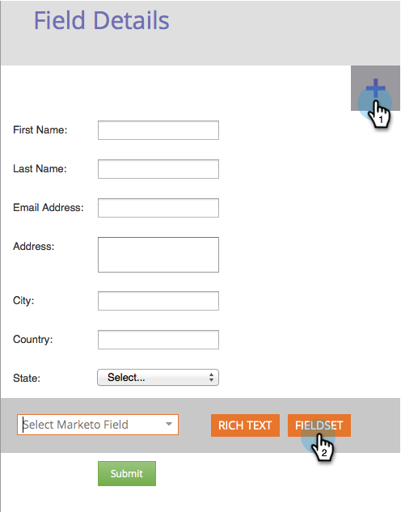

# Agregar un conjunto de campos a un formulario {#add-a-fieldset-to-a-form}

Los conjuntos de campos son geniales. Agrupan un montón de campos juntos. ¡También puedes controlar todo un bloque a la vez!

1. Vaya a **Actividades de marketing**.

   

1. Seleccione el formulario y haga clic en **Editar formulario**.

   

1. Haga clic en el **+** firmar y seleccionar **Conjunto de campos**.

   

1. Seleccione el **fieldSet** e introduzca un **Etiqueta**.

   

1. Arrastre los campos que desee a la **fieldSet**.

   

1. Así debería ser cuando se hace.

   

¡Ahí lo tienes!

>[!TIP]
>
>Puede ocultar o mostrar dinámicamente todo el conjunto de campos en función de otro campo. Obtenga información sobre [reglas de visibilidad](/help/marketo/product-docs/demand-generation/forms/form-fields/dynamically-toggle-visibility-of-a-form-field.md).
