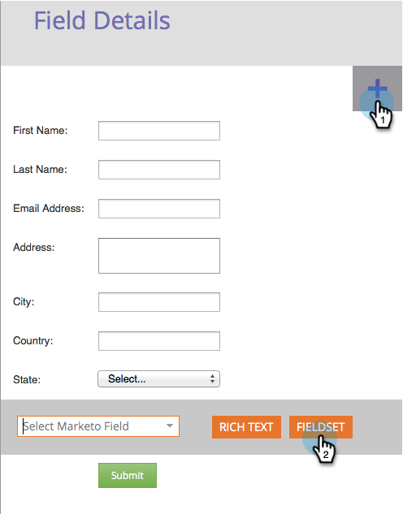

# Añadir un conjunto de campos a un formulario {#add-a-fieldset-to-a-form}

Los conjuntos de campos agrupan un conjunto de campos. Puede controlar un bloque entero a la vez.

1. Vaya a **[!UICONTROL Actividades de marketing]**.

   

1. Seleccione el formulario y haga clic en **[!UICONTROL Editar formulario]**.

   

1. Haga clic en el signo **+** y seleccione **[!UICONTROL Conjunto de campos]**.

   

1. Seleccione el **conjunto de campos** e introduzca una **[!UICONTROL etiqueta]**.

   

1. Arrastre los campos que desee al **conjunto de campos**.

   

1. A continuación se muestra el aspecto que debería tener cuando se termine.

   

>[!TIP]
>
>Puede ocultar o mostrar dinámicamente todo el conjunto de campos en función de otro campo. Más información sobre [reglas de visibilidad](/help/marketo/product-docs/demand-generation/forms/form-fields/dynamically-toggle-visibility-of-a-form-field.md).
