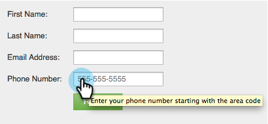

# Añadir instrucciones de ayuda contextual a un campo de formulario {#add-tooltip-instructions-to-a-form-field}

[Sugerencias](/help/marketo/product-docs/demand-generation/forms/form-fields/add-hint-text-to-a-form-field.md) e instrucciones ayudan a las personas a rellenar formularios. A continuación se indica cómo añadir instrucciones de información sobre herramientas.

>[!NOTE]
>
>**Definición**
>
>El formulario **Hints** es texto que se encuentra dentro del campo y que desaparece cuando el visitante comienza a escribir en el campo.
>
>Las **instrucciones** del formulario son pequeñas descripciones emergentes cuando el visitante pasa el ratón sobre el campo.

1. Vaya a **[!UICONTROL Actividades de marketing]**.

   

1. Seleccione su **formulario** y haga clic en **[!UICONTROL Editar formulario]**.

   

1. Seleccione su campo e ingrese **[!UICONTROL Instrucciones]**.

   

1. Haga clic en **[!UICONTROL Finalizar]**.

   

1. Haga clic en **[!UICONTROL Aprobar y cerrar]**.

   

   >[!NOTE]
   >
   >Recuerde [aprobar los cambios del borrador de la página de aterrizaje](/help/marketo/product-docs/demand-generation/landing-pages/understanding-landing-pages/approve-unapprove-or-delete-a-landing-page.md) creado por el formulario.

   

La información del objeto aparecerá cuando un visitante pase el ratón sobre el campo.
