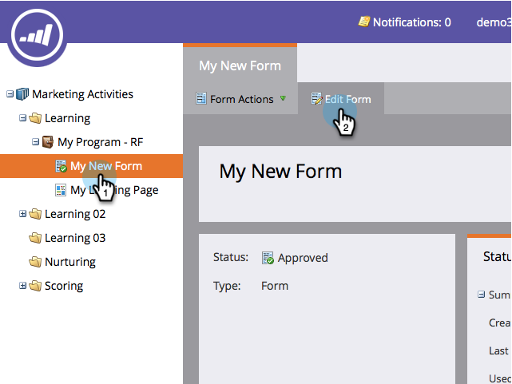

# Añadir instrucciones de información sobre herramientas a un campo de formulario {#add-tooltip-instructions-to-a-form-field}

[Las ](/help/marketo/product-docs/demand-generation/forms/form-fields/add-hint-text-to-a-form-field.md) sugerencias e instrucciones ayudan a las personas a rellenar formularios. A continuación se explica cómo agregar instrucciones de información sobre herramientas.

>[!NOTE]
>
>**Definición**
>
>El formulario **Sugerencias** es texto que aparece dentro del campo y que desaparece cuando el visitante comienza a escribir en el campo.
>
>Las **Instrucciones** del formulario son pequeñas sugerencias que aparecen cuando el visitante se sitúa sobre el campo.

1. Vaya a **Actividades de marketing**.

   

1. Seleccione el **formulario** y haga clic en **Editar formulario**.

   

1. Seleccione el campo e introduzca **Instrucciones**.

   

1. Haga clic en **Finalizar**.

   

1. Haga clic en **Aprobar y cerrar**.

   

   >[!NOTE]
   >
   >No olvide [aprobar el borrador de página de aterrizaje](/help/marketo/product-docs/demand-generation/landing-pages/understanding-landing-pages/approve-unapprove-or-delete-a-landing-page.md) creado por los cambios de formulario.

   

¡Increíble trabajo! La información sobre herramientas se mostrará cuando un visitante pase el ratón sobre el campo.
