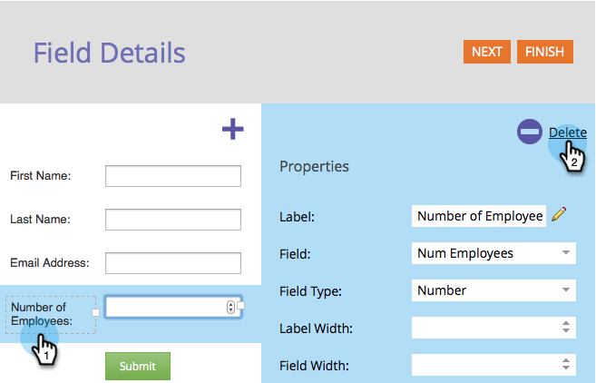

# Eliminar campo de un formulario {#delete-a-field-in-a-form}

Si hay un campo que ya no necesita en el formulario, se puede eliminar fácilmente. Así es cómo se hace.

1. Vaya a **[!UICONTROL Actividades de marketing]**.

   

1. Seleccione el formulario y haga clic en **[!UICONTROL Editar formulario]**.

   

1. Seleccione el campo y haga clic en el icono **[!UICONTROL Eliminar]**.

   

1. Haga clic en **[!UICONTROL Finalizar]**.

   

1. Haga clic en **[!UICONTROL Aprobar y cerrar]**.

   

>[!NOTE]
>
>Recuerde [aprobar los cambios del borrador de la página de aterrizaje](/help/marketo/product-docs/demand-generation/landing-pages/understanding-landing-pages/approve-unapprove-or-delete-a-landing-page.md) creado por el formulario.
