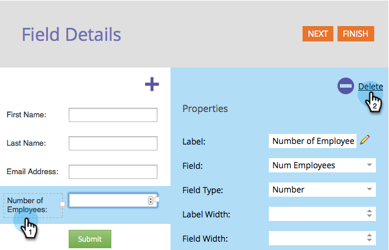

# Eliminar un campo de un formulario {#delete-a-field-in-a-form}

Si ya no necesita un campo en el formulario, puede eliminarlo fácilmente. Así es como.

1. Vaya a **Actividades de marketing**.

   

1. Seleccione el formulario y haga clic en **Editar formulario**.

   

1. Seleccione el campo y haga clic en el icono **eliminar**.

   

1. Haga clic en **Finalizar**.

   

1. Haga clic en **Aprobar y cerrar**.

   

>[!NOTE]
>
>No olvide [aprobar el borrador de página de aterrizaje](/help/marketo/product-docs/demand-generation/landing-pages/understanding-landing-pages/approve-unapprove-or-delete-a-landing-page.md) creado por los cambios de formulario.
