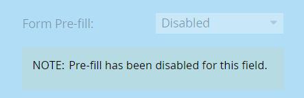

# Deshabilitar el rellenado previo de un campo de formulario {#disable-pre-fill-for-a-form-field}

Cuando se conoce (se coordina) a un visitante web, los formularios de Marketo rellenarán previamente los campos con su información de forma predeterminada. Si quieres apagar esto, así es como hacerlo.

>[!NOTE]
>
>**Formulario Previo al** archivo habilitado de forma predeterminada. La configuración de rellenado previo de nivel de página de aterrizaje y la configuración de rellenado previo de nivel de administrador prevalecen sobre la configuración de nivel de formulario:
>
>Formulario > Página de aterrizaje > Administración

## Deshabilitar el rellenado previo {#how-to-disable-pre-fill}

1. Vaya a **Marketing Activities**.

   

1. Seleccione el formulario y haga clic en **Editar formulario**.

   

   >[!CAUTION]
   >
   >El rellenado previo del formulario no funciona al incrustar un formulario en sus propias páginas. Solo funciona en páginas de aterrizaje de Marketo.

1. Seleccione uno de los campos y establezca **Form Pre-fill** en **Disabled**.

   

   >[!TIP]
   >
   >También puede desactivar el rellenado previo del formulario en la página de aterrizaje o a nivel de administrador.

1. Haga clic en **Finish**.

   

1. Haga clic en **Aprobar y cerrar**.

   

## Campos confidenciales {#sensitive-fields}

Cuando [marque un campo como sensible](/help/marketo/product-docs/administration/field-management/mark-a-field-as-sensitive.md), evitando que sus valores se rellenen previamente en formularios, lo verá en la opción Relleno previo .

