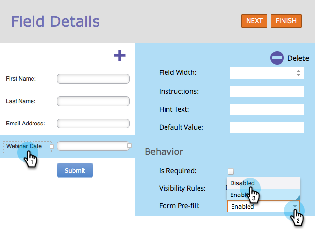

# Deshabilitar el rellenado previo de un campo de formulario {#disable-pre-fill-for-a-form-field}

Cuando se conoce a un visitante web (con cookies), los formularios de Marketo rellenarán previamente los campos con su información de forma predeterminada. Si quieres apagar esto, así es como se hace.

>[!NOTE]
>
>**Rellenar previamente formulario** está habilitado de manera predeterminada. La configuración de rellenado previo del nivel de página de aterrizaje y la configuración de relleno previo del nivel de administrador supera la configuración del nivel de formulario:
>
>Formulario > Página de aterrizaje > Administración

## Cómo deshabilitar el relleno previo {#how-to-disable-pre-fill}

1. Vaya a **[!UICONTROL Actividades de marketing]**.

   

1. Seleccione el formulario y haga clic en **[!UICONTROL Editar formulario]**.

   

   >[!CAUTION]
   >
   >El rellenado previo del formulario no funciona al incrustar un formulario en sus propias páginas. Solo funciona en páginas de aterrizaje de Marketo.

1. Seleccione uno de los campos y establezca **[!UICONTROL Relleno previo de formulario]** en **[!UICONTROL Deshabilitado]**.

   

   >[!TIP]
   >
   >También puede deshabilitar el rellenado previo de formularios en el nivel de página de aterrizaje o de administrador.

1. Haga clic en **[!UICONTROL Finalizar]**.

   

1. Haga clic en **[!UICONTROL Aprobar y cerrar]**.

   

## Campos confidenciales {#sensitive-fields}

Cuando [marca un campo como confidencial](/help/marketo/product-docs/administration/field-management/mark-a-field-as-sensitive.md), lo que impide que sus valores se rellenen previamente en los formularios, verá esto en la opción Relleno previo.

