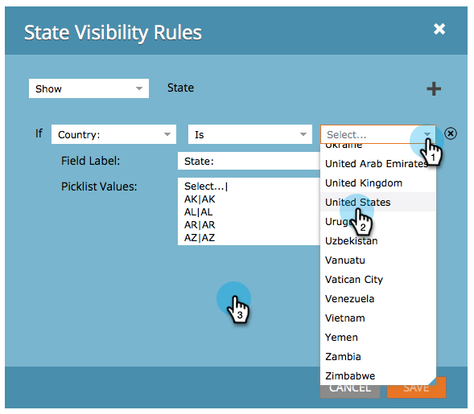

# Alternar dinámicamente la visibilidad de un campo de formulario {#dynamically-toggle-visibility-of-a-form-field}

>[!PREREQUISITES]
>
>* [Agregar una lista de selección de país a su formulario](/help/marketo/product-docs/demand-generation/forms/form-actions/add-a-country-picklist-to-your-form.md)

Una característica muy interesante de los formularios Marketo es que puede ocultar o mostrar dinámicamente los campos de formulario o [fieldsets](/help/marketo/product-docs/demand-generation/forms/form-fields/add-a-fieldset-to-a-form.md).

>[!NOTE]
>
>**Ejemplo**
>
>En este ejemplo, vamos a ocultar la variable **Estado** field a menos que **País** se selecciona como &quot;Estados Unidos&quot;.

1. Ir a **Actividades de marketing**.

   

1. Seleccione el formulario y haga clic en **Editar formulario**.

   

1. Seleccione el campo que desea ocultar o mostrar dinámicamente y haga clic en el vínculo para **Reglas de visibilidad**.

   

1. Busque y seleccione el campo en el que desea generar una condición.

   

1. Seleccione el operador.

   >[!TIP]
   >
   >Esto es genial porque puede elegir coincidencias aproximadas como &quot;comienza con&quot;.

   

1. Seleccione los valores que desea buscar y haga clic fuera de la lista desplegable.

   

   >[!TIP]
   >
   >Puede seleccionar varios valores haciendo clic en ellos mientras la lista desplegable está abierta. Por ejemplo, puede seleccionar Estados Unidos y Canadá.

   >[!NOTE]
   >
   >Anteriormente convertimos País a un tipo de campo de lista de selección y [se agregaron todos los países como valores](/help/marketo/product-docs/demand-generation/forms/form-actions/add-a-country-picklist-to-your-form.md).

1. Clic **Guardar**.

   

¡Y eso es todo! Ahora, cuando las personas rellenan este formulario y seleccionan Estados Unidos por país, el campo Estado aparece dinámicamente con las opciones especificadas.

>[!IMPORTANT]
>
>El comportamiento del campo de formulario funcionará sin problemas cuando los valores del campo se establezcan o actualicen mediante scripts personalizados con [Funciones de API](https://developers.marketo.com/javascript-api/forms/){target="_blank"} en Forms 2.0.
>
>Es posible que los campos condicionales no funcionen según lo esperado si los valores de los campos los modifican scripts externos que no sean la API de JavaScript de Forms 2.0.
