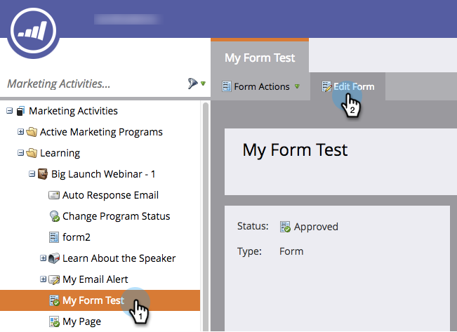

# Reordenar campos en un formulario {#reorder-fields-in-a-form}

Es fácil reordenar los campos en un formulario de Marketo. Así es cómo se hace.

1. Vaya a **[!UICONTROL Actividades de marketing]**.

   

1. Seleccione el formulario y haga clic en **[!UICONTROL Editar formulario]**.

   

1. Arrastre y suelte los campos en el orden que desee.

   

>[!TIP]
>
>También puede arrastrar y soltar los campos uno junto al otro. Esto le permite crear columnas.

¡Buen trabajo! Estás meciendo esta cosa.
