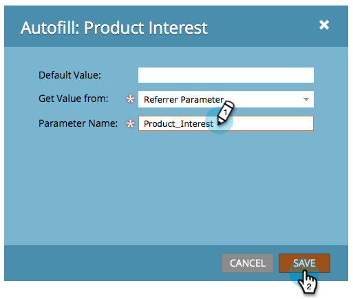

# Definir un valor de campo de formulario oculto {#set-a-hidden-form-field-value}

Los campos ocultos se rellenan normalmente de forma dinámica. No se muestran a la persona que rellena el formulario. Así es como se establece el valor.

>[!PREREQUISITES]
>
>[Definir un campo de formulario como oculto](/help/marketo/product-docs/demand-generation/forms/form-fields/set-a-form-field-as-hidden.md)

## Seleccione el campo {#select-the-field}

1. En el formulario, seleccione el campo oculto y haga clic en **Editar** para **Relleno automático**.

   

## Usar valor predeterminado {#use-default-value}

Al seleccionar Usar valor predeterminado , puede codificar en forma rígida un valor específico que se utilizará siempre cuando se envíe este formulario. Introduzca el valor predeterminado y haga clic en Guardar.

## Parámetro de URL {#url-parameter}

Si desea capturar los parámetros de URL (cadenas de consulta) de la página en la que se encuentra la persona al rellenar el formulario, puede utilizar **Parámetros de URL** para rellenar el campo oculto.

>[!NOTE]
>
>Los parámetros son algo técnicos, ¿no? Una vez que los consigues, son poderosos. Esta [Página de Wikipedia en cadenas de consulta](https://en.wikipedia.org/wiki/Query_string) es algo útil.

1. Select **Parámetro de URL** para **Obtener tipo de valor**.

   

1. Introduzca la variable **Nombre del parámetro** y haga clic en **Guardar**.

   

>[!TIP]
>
>Puede introducir un valor predeterminado en caso de que no se encuentre el parámetro de URL.

## Valor de cookie {#cookie-value}

Si está almacenando datos en cookies, puede utilizar **Valor de cookie** para recoger los datos cuando se envíe el formulario.

1. Select **Valor de cookie** para **Obtener valor de**.

   

1. Escriba el nombre del parámetro de la cookie que desee y haga clic en **Guardar**.

   

   >[!TIP]
   >
   >Puede introducir un valor predeterminado en caso de que no se encuentre el parámetro o la cookie.

## Parámetro de referente {#referrer-parameter}

Si desea capturar datos de la página de la que provino el visitante antes de rellenar el formulario, puede utilizar **Parámetro de referente**.

1. Establezca **Obtener valor de** a **Parámetro de referente**.

   

1. Introduzca la variable **Nombre del parámetro** que desea extraer de la dirección URL del referente y hacer clic en **Guardar**.

   

   >[!TIP]
   >
   >Puede especificar un **Valor predeterminado** en caso de que no se encuentre el parámetro referrer .

1. Haga clic en **Finalizar**.

   

1. Haga clic en **Aprobar y cerrar**.

   
