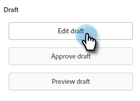
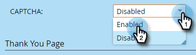

# Habilitar CAPTCHA en Marketo Forms {#enable-captcha-in-marketo-forms}

Puede habilitar/deshabilitar CAPTCHA por formulario.

1. Busque y seleccione el formulario que desee.

   

1. Haga clic en **Editar borrador** (si el formulario ya está aprobado, haga clic en Crear borrador).

   

1. Haga clic en **Configuración de formulario**, luego **Configuración**.

   

1. Abra la lista desplegable CAPTCHA y seleccione **Habilitado**.

   

1. Haga clic en **Finalizar**.

   

1. Haga clic en **Aprobar y cerrar**.

   

Los cambios realizados en esta lista pueden tardar unos minutos en propagarse desde Google.

>[!NOTE]
>
>Google añade texto estandarizado, incluidos vínculos a su Política de privacidad y a los Términos de servicio a los formularios habilitados para CAPTCHA.

>[!MORELIKETHIS]
>
>[Configuración de reCAPTCHA v3](/help/marketo/product-docs/demand-generation/forms/using-captcha/setting-up-recaptcha-v3.md)
