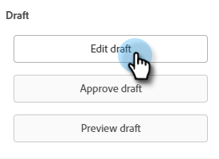

# Habilitar CAPTCHA en formularios de Marketo {#enable-captcha-in-marketo-forms}

Puede habilitar o deshabilitar [!UICONTROL CAPTCHA] por formulario.

1. Busque y seleccione el formulario que desee.

   

1. Haga clic en **[!UICONTROL Editar borrador]** (si el formulario ya está aprobado, haga clic en [!UICONTROL Crear borrador]).

   

1. Haga clic en **[!UICONTROL Configuración de formulario]** y luego en **[!UICONTROL Configuración]**.

   

1. Abra la lista desplegable **[!UICONTROL CAPTCHA]** y seleccione **[!UICONTROL Habilitado]**.

   

1. Haga clic en **[!UICONTROL Finalizar]**.

   

1. Haga clic en **[!UICONTROL Aprobar y cerrar]**.

   

Los cambios en esta lista pueden tardar unos minutos en propagarse desde Google.

>[!NOTE]
>
>Se agregará texto estandarizado, incluidos vínculos a la Política de privacidad y los Términos de servicio de Google, a los formularios habilitados para CAPTCHA.

>[!MORELIKETHIS]
>
>[Configurando reCAPTCHA v3](/help/marketo/product-docs/demand-generation/forms/using-captcha/setting-up-recaptcha-v3.md)
