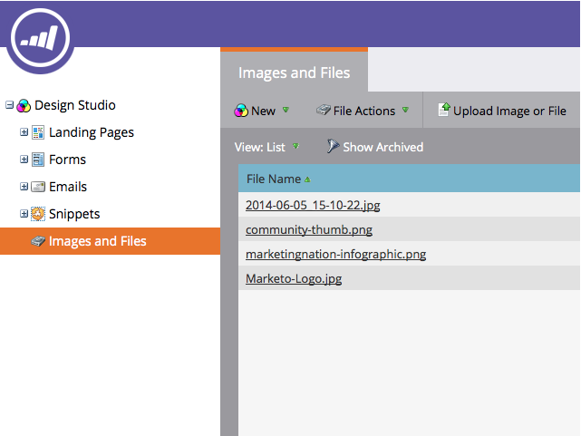

# Eliminar una imagen o un archivo cargados {#delete-an-uploaded-image-or-file}

1. Vaya a la **Diseño** **Studio**.

   

1. Seleccionar **Imágenes y archivos** en el menú de la izquierda, haga clic en junto al nombre del archivo que desea eliminar.

   

1. Haga clic en **Acciones de archivo** y seleccione. **Eliminar**.

   

1. Compruebe que ha seleccionado el archivo correcto y haga clic en **Eliminar**.

   

   >[!CAUTION]
   >
   >Las imágenes y los archivos eliminados se eliminan completamente de Marketo y no se pueden recuperar.  Ya no se mostrarán en ninguna página de aterrizaje ni en correos electrónicos en los que se hayan utilizado.

1. Se le devolverá a la **Imágenes** y **Archivos** página, donde verá que el archivo se ha eliminado.

   

¡Bien hecho!

>[!MORELIKETHIS]
>
>* [Reemplazar una imagen o archivo cargado](/help/marketo/product-docs/demand-generation/images-and-files/replace-an-uploaded-image-or-file.md)
>* [Buscar imágenes y archivos cargados](/help/marketo/product-docs/demand-generation/images-and-files/search-uploaded-images-and-files.md)
>* [Buscar la dirección URL de una imagen o archivo cargado](/help/marketo/product-docs/demand-generation/images-and-files/find-the-url-of-an-uploaded-image-or-file.md)
