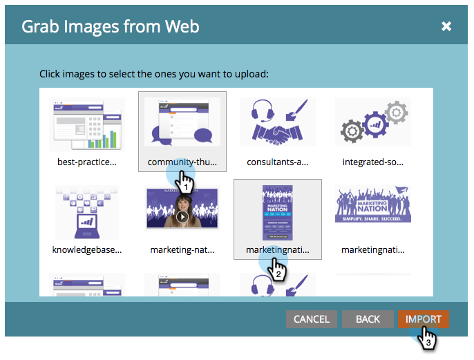

# Captar las imágenes desde la página web {#grab-the-images-from-a-web-page}

Para añadir imágenes desde una página web, copie la dirección web (URL) de la página que tiene las imágenes que desea y, a continuación, siga estos pasos.

1. Vaya a **[!UICONTROL Design Studio]**.

   

1. Haz clic en **[!UICONTROL Nuevo]** y **[!UICONTROL Capturar imágenes de la web]**.

   

1. Seleccione la carpeta **[!UICONTROL Imágenes y archivos]**, pegue la dirección web (URL) en el cuadro de texto URL y haga clic en **[!UICONTROL Siguiente]**.

   

   >[!NOTE]
   >
   >Esta función no funciona con direcciones URL que apuntan directamente a una imagen. Utilice la dirección URL de la página web que contiene las imágenes.

1. Seleccione las imágenes que desee agregar y haga clic en **[!UICONTROL Importar]**.

   

1. Las imágenes se han importado y están disponibles para su uso en correos electrónicos y páginas de aterrizaje.

   

1. Puede ver todas las imágenes disponibles en **[!UICONTROL Imágenes y archivos]**.

   

>[!MORELIKETHIS]
>
>* [Agregar imágenes y archivos a Marketo](/help/marketo/product-docs/demand-generation/images-and-files/add-images-and-files-to-marketo.md)
>* [Organizar imágenes y archivos mediante carpetas](/help/marketo/product-docs/demand-generation/images-and-files/organize-your-images-and-files-using-folders.md)
>* [Buscar la dirección URL de una imagen o archivo cargado](/help/marketo/product-docs/demand-generation/images-and-files/find-the-url-of-an-uploaded-image-or-file.md)
>* [Cargar imágenes y archivos desde Box](/help/marketo/product-docs/demand-generation/images-and-files/upload-images-and-files-from-box.md)
