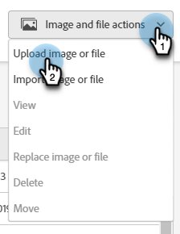

# Nuevo documento Agregar imágenes {#new-add-images-doc}

Tiene varias opciones para agregar nuevos archivos e imágenes al repositorio de imágenes y archivos.

## Cargar imagen o archivo {#upload-image-or-file}

1. Vaya a la **Design Studio**.

   

1. Seleccionar **[!UICONTROL Imágenes y archivos]**

   

1. Haga clic en **[!UICONTROL Acciones de imagen y archivo]** y seleccione. **[!UICONTROL Cargar imagen o archivo]**.

   

1. Arrastre y suelte la imagen o el archivo deseados o busque en el equipo.

   

1. Una vez seleccionado el recurso, haga clic en **Cargar**.

   

## Importar imagen o archivo {#import-image-or-file}

Tiene tres opciones para importar una imagen. Vamos a repasar cada uno de ellos.

### Importación desde la web {#import-from-the-web}

Texto

1. Siga los pasos 1 y 2 [desde arriba](#upload-image-or-file).

1. Haga clic en **[!UICONTROL Acciones de imagen y archivo]** y seleccione. **[!UICONTROL Importar imagen o archivo]**.

   

1. Seleccione el **Web** opción.

   

1. Texto

PICC

### Importar desde Box {#import-from-box}

Texto

1. Siga los pasos 1 y 2 [desde arriba](#upload-image-or-file).

1. Haga clic en **[!UICONTROL Acciones de imagen y archivo]** y seleccione. **[!UICONTROL Importar imagen o archivo]**.

PICC

1. Texto

### Importar de Adobe Experience Manager {#import-from-adobe-experience-manager}

Texto

1. Siga los pasos 1 y 2 [desde arriba](#upload-image-or-file).

1. Haga clic en **[!UICONTROL Acciones de imagen y archivo]** y seleccione. **[!UICONTROL Importar imagen o archivo]**.

PICC

1. Texto
