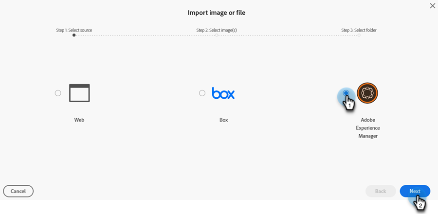

# Nuevo documento Agregar imágenes {#new-add-images-doc}

Tiene varias opciones para agregar nuevos archivos e imágenes al repositorio de imágenes y archivos.

## Cargar imagen o archivo {#upload-image-or-file}

1. Vaya a **Design Studio**.

   

1. Seleccionar **[!UICONTROL imágenes y archivos]**

   

1. Haga clic en la lista desplegable **[!UICONTROL Acciones de imagen y archivo]** y seleccione **[!UICONTROL Cargar imagen o archivo]**.

   

1. Arrastre y suelte la imagen o el archivo deseados o busque en el equipo.

   

1. Una vez seleccionado el recurso, haga clic en **Cargar**.

   

## Importar imagen o archivo {#import-image-or-file}

Tiene tres opciones para importar una imagen. Vamos a repasar cada uno de ellos.

### Importación desde la web {#import-from-the-web}

Texto

1. Siga los pasos 1 y 2 [de arriba](#upload-image-or-file).

1. Haga clic en la lista desplegable **[!UICONTROL Acciones de imagen y archivo]** y seleccione **[!UICONTROL Importar imagen o archivo]**.

   

1. Seleccione la opción **[!UICONTROL Web]** y haga clic en **[!UICONTROL Siguiente]**.

   

1. Escriba o pegue la dirección URL en la imagen deseada y haga clic en **Siguiente**.

PICC

1. Haga clic en EN BLANCO.

PICC

### Importar desde Box {#import-from-box}

Texto

1. Siga los pasos 1 y 2 [de arriba](#upload-image-or-file).

1. Haga clic en la lista desplegable **[!UICONTROL Acciones de imagen y archivo]** y seleccione **[!UICONTROL Importar imagen o archivo]**.

   

1. Seleccione la opción **[!UICONTROL Box]** y haga clic en **[!UICONTROL Next]**.

   

   >[!NOTE]
   >
   >Si no lo ha hecho anteriormente, se le pedirá que inicie sesión en su cuenta de Box para conceder acceso.

1. Seleccione la carpeta Box que desee y haga clic en **[!UICONTROL Siguiente]**.

   

1. Seleccione las imágenes que desee y haga clic en **[!UICONTROL Siguiente]**.

   

1. Seleccione el Marketo Engage en el que desea guardar la imagen. En este ejemplo lo dejaremos como Imágenes y archivos (predeterminado). Haga clic en **Importar**.

   

### Importar de Adobe Experience Manager {#import-from-adobe-experience-manager}

Texto

1. Siga los pasos 1 y 2 [de arriba](#upload-image-or-file).

1. Haga clic en la lista desplegable **[!UICONTROL Acciones de imagen y archivo]** y seleccione **[!UICONTROL Importar imagen o archivo]**.

   

1. Seleccione la opción **[!UICONTROL Adobe Experience Manager]** y haga clic en **[!UICONTROL Siguiente]**.

   

   >[!NOTE]
   >
   >AEM Si no lo has hecho anteriormente, se te pedirá que inicies sesión en tu cuenta de la cuenta de la cuenta de la cuenta de la cuenta de la cuenta de usuario de tu cuenta de la cuenta de usuario.

1. Texto

PICC

1. Texto

PICC

1. Texto
