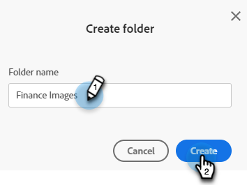

# Organizar imágenes y archivos mediante carpetas {#organize-your-images-and-files-using-folders}

La creación de carpetas permite mover imágenes y archivos, ver solo el conjunto de imágenes que desee y cargar directamente en una carpeta específica.

1. Vaya a **[!UICONTROL Design Studio]**.

   

1. Haga clic con el botón derecho en **[!UICONTROL Imágenes y archivos]** y seleccione **[!UICONTROL Nueva carpeta]**.

   

1. Asigne un nombre a la carpeta y haga clic en **[!UICONTROL Crear]**.

   

1. Vuelva a **[!UICONTROL Imágenes y archivos]** y seleccione el recurso que desea mover. Haga clic en la lista desplegable **[!UICONTROL Acciones de imagen y archivo]** y seleccione **[!UICONTROL Mover]**.

   

1. Seleccione la carpeta que desee.

   

1. Haz clic en **MMover**.

   

>[!MORELIKETHIS]
>
>[Buscar imágenes y archivos cargados](/help/marketo/product-docs/demand-generation/images-and-files/search-uploaded-images-and-files.md){target="_blank"}
