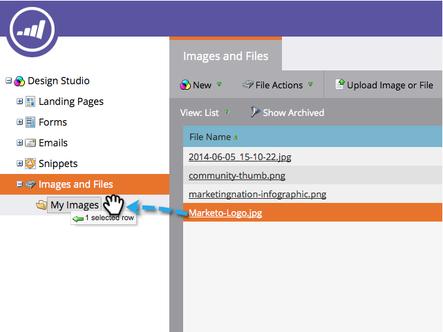

# Organizar las imágenes y los archivos mediante carpetas {#organize-your-images-and-files-using-folders}

La creación de carpetas permite mover imágenes y archivos, ver solo el conjunto de imágenes que desea y cargar directamente a una carpeta específica.

1. Vaya a la **Design Studio**.

   

1. Haga clic con el botón derecho en **Imágenes y archivos** en el menú de la izquierda, seleccione **Nueva carpeta**.

   

1. Cuando aparezca la nueva carpeta, asígnele un nombre.

   

1. Vaya a **Imágenes y archivos**, ahora puede arrastrar y soltar en la carpeta que desee.

   

¡Los cinco! Todos están configurados para la utopía de carpeta.

>[!MORELIKETHIS]
>
>[Buscar imágenes y archivos cargados](/help/marketo/product-docs/demand-generation/images-and-files/search-uploaded-images-and-files.md)
