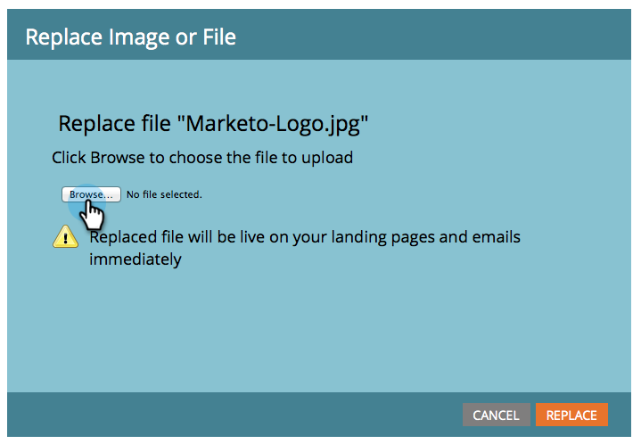

# Reemplazar una imagen o archivo cargado {#replace-an-uploaded-image-or-file}

1. Vaya a la **Design Studio**.

   

1. Haga clic en **Imágenes y archivos** y, a continuación, seleccione el archivo que desea reemplazar.

   

   >[!TIP]
   >
   >También puede [buscar imágenes o archivos cargados](/help/marketo/product-docs/demand-generation/images-and-files/search-uploaded-images-and-files.md).

1. Haga clic en **Acciones de archivo** y seleccione **Reemplazar imagen o archivo**.

   

1. Vaya al archivo del equipo que reemplazará el archivo actual y selecciónelo.

   

   >[!NOTE]
   >
   >Si no puede seleccionar un archivo de una carpeta compartida, guarde ese archivo en su disco duro y selecciónelo desde allí.

1. Compruebe que el archivo mostrado junto a **Elegir archivo** es correcto y, a continuación, haga clic en **Reemplazar**.

   

>[!NOTE]
>
>El nombre del archivo de reemplazo cambiará para coincidir con el nombre de archivo anterior.

¡Lo hiciste!

>[!MORELIKETHIS]
>
>* [Buscar imágenes y archivos cargados](/help/marketo/product-docs/demand-generation/images-and-files/search-uploaded-images-and-files.md)
>* [Buscar la URL de una imagen o archivo cargado](/help/marketo/product-docs/demand-generation/images-and-files/find-the-url-of-an-uploaded-image-or-file.md)

