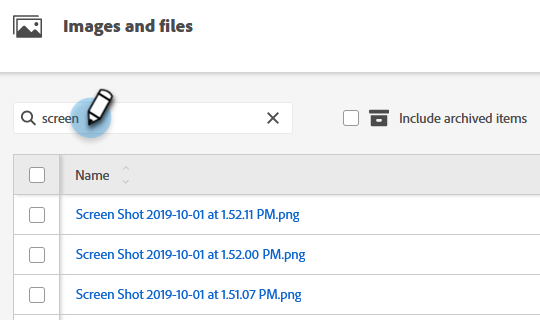

# Buscar imágenes y archivos cargados {#search-uploaded-images-and-files}

Obtenga información sobre cómo buscar una imagen o un archivo.

1. Vaya a **[!UICONTROL Design Studio]**.

   

1. Haga clic en **[!UICONTROL Imágenes y archivos]** para obtener la lista completa de todos los archivos cargados.

   

1. En el cuadro Buscar, escriba la palabra con la que comienza el archivo y presione **Entrar**.

   

>[!NOTE]
>
>La búsqueda de imágenes y archivos solo utiliza la funcionalidad &quot;comienza con&quot; en este momento.

>[!MORELIKETHIS]
>
>* [Reemplazar una imagen o archivo cargado](/help/marketo/product-docs/demand-generation/images-and-files/replace-an-uploaded-image-or-file.md){target="_blank"}
>* [Organizar imágenes y archivos mediante carpetas](/help/marketo/product-docs/demand-generation/images-and-files/organize-your-images-and-files-using-folders.md){target="_blank"}
