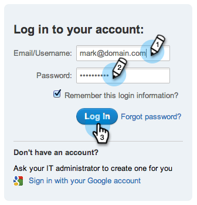
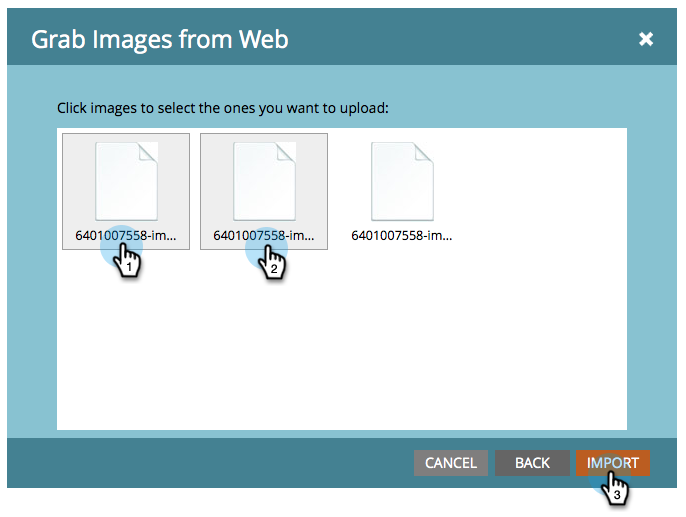

# Cargar imágenes y archivos desde Box {#upload-images-and-files-from-box}

Puede cargar archivos desde Box para utilizarlos en páginas de aterrizaje y correos electrónicos.

1. Vaya a **[!UICONTROL Design Studio]**.

   

1. Ir a **[!UICONTROL Imágenes y archivos]**. Haga clic en **[!UICONTROL Acciones de archivo]** y seleccione **[!UICONTROL Capturar imágenes de la web]**.

   

1. Haga clic en **[!UICONTROL Cuadro]**.

   

1. Escriba su inicio de sesión de [!DNL Box].

   

1. Permitir que Marketo acceda a su cuenta de [!DNL Box].

   

1. Elija dónde desea guardar los archivos. A continuación, seleccione la carpeta **[!DNL Box]** desde la cual desee realizar la carga. Haga clic en **[!UICONTROL Siguiente]**.

   

1. Seleccione los archivos que desee cargar. Haga clic en **[!UICONTROL Importar]**.

   

Sus archivos ya están listos para utilizarse en sus páginas de aterrizaje y correos electrónicos.
