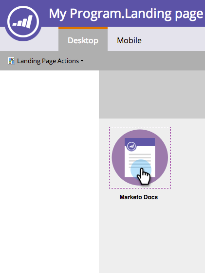

# Adición de un vínculo a una imagen en una página de destino de forma libre {#add-a-link-to-an-image-in-a-free-form-landing-page}

Para hacer que una imagen de la página de aterrizaje sea un vínculo en el que se puede hacer clic, siga los pasos a continuación.

>[!PREREQUISITES]
>
>[Agregar una imagen a una página de aterrizaje de forma libre](/help/marketo/product-docs/demand-generation/landing-pages/free-form-landing-pages/add-an-image-to-a-free-form-landing-page.md)

1. Haga clic en la imagen a la que desee agregar un vínculo.

   

1. Expanda la **[!UICONTROL hoja de propiedades]**.

   

1. Copie o escriba el vínculo en el cuadro **[!UICONTROL linkUrl]**.

   

   Se ha añadido correctamente un vínculo a una imagen de la página de aterrizaje. Ahora puede [obtener una vista previa de la página](/help/marketo/product-docs/demand-generation/landing-pages/landing-page-actions/preview-a-landing-page.md) para verla en acción.

>[!TIP]
>
>Pruebe siempre las páginas.
