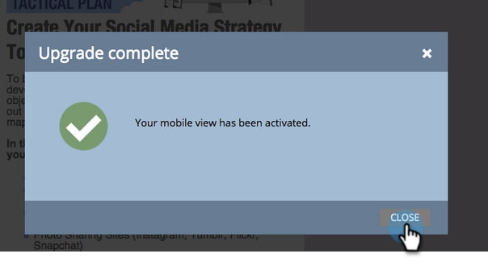

# Agregar una vista móvil para la página de aterrizaje de forma libre {#add-a-mobile-view-for-your-free-form-landing-page}

Es fácil hacer que sus páginas de aterrizaje de forma libre tengan un aspecto bueno en un smartphone.

>[!NOTE]
>
>La vista móvil funciona en pantallas de 480 píxeles de ancho (o menos). En otras palabras, los teléfonos inteligentes. Aquí hay más [información sobre resoluciones de dispositivos](https://www.mydevice.io/).

1. Vaya a **Actividades de marketing**.

   

1. Seleccione una página de aterrizaje de forma libre.

   

1. Haga clic en **Editar borrador**.

   

1. Haga clic en el **Móvil** pestaña .

   

1. Haga clic en **Activar**.

   

   >[!CAUTION]
   >
   >Puede que sea necesario actualizar la plantilla de formulario libre. Si ve ese mensaje, lea rápidamente cómo [hacer compatible una plantilla de página de aterrizaje de forma libre existente con dispositivos móviles](/help/marketo/product-docs/demand-generation/landing-pages/landing-page-templates/make-an-existing-free-form-landing-page-template-mobile-compatible.md).

1. ¡Excelente! Ahora ha activado la versión móvil de la página de aterrizaje. Haga clic en **Cerrar**.

   

   Ahora puede [personalizar la vista móvil](/help/marketo/product-docs/demand-generation/landing-pages/free-form-landing-pages/customize-mobile-view-for-your-free-form-landing-page.md).

   
