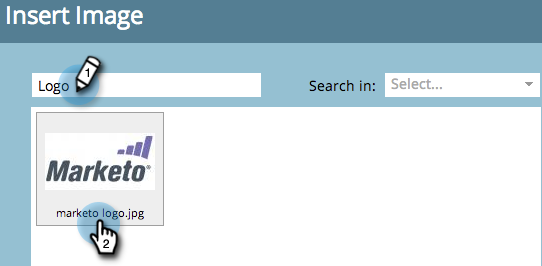

# Agregar una imagen a una página de aterrizaje de forma libre {#add-an-image-to-a-free-form-landing-page}

>[!PREREQUISITES]
>
>[Agregar imágenes y archivos a Marketo](/help/marketo/product-docs/demand-generation/images-and-files/add-images-and-files-to-marketo.md)

1. Seleccione la página de aterrizaje de forma libre y haga clic en **Editar** **Borrador**.

   

1. En el editor, arrastre el ratón sobre la **Imagen** elemento.

   

1. Busque y seleccione la imagen que desee.

   

1. Haga clic en **Insertar**.

   

   ¡bueno trabajo! Acaba de añadir una imagen a la página de aterrizaje de forma libre.

   
