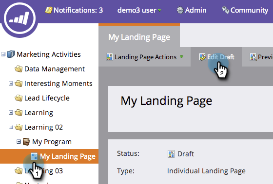
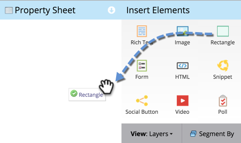
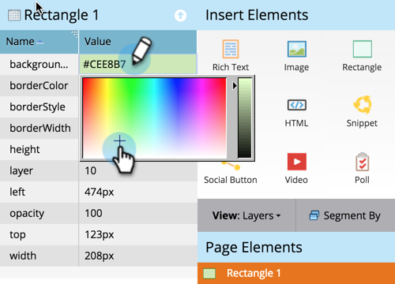

# Añadir un rectángulo a una página de destino de forma libre {#adding-a-rectangle-to-a-free-form-landing-page}

Los rectángulos en las páginas de aterrizaje se pueden utilizar para resaltar o separar visualmente secciones de contenido.

1. Seleccione una página de aterrizaje de forma libre y haga clic en **[!UICONTROL Editar borrador]**.

   

   >[!NOTE]
   >
   >El diseñador de páginas de aterrizaje de forma libre se abre en una nueva ventana.

1. Arrastre el cursor sobre el elemento **[!UICONTROL Rectangle]**.

   

1. Seleccione el rectángulo y use la **[!UICONTROL Hoja de propiedades]** para realizar los cambios necesarios.

   >[!TIP]
   >
   >Puede mover y cambiar el tamaño del rectángulo arrastrando y soltando. Pruebe también las flechas del teclado. Sugerencia: pulse Mayús-Flecha para mover el rectángulo de 10 píxeles cada vez.

   

Ahora puede agregar rectángulos a las páginas de aterrizaje de forma libre.
