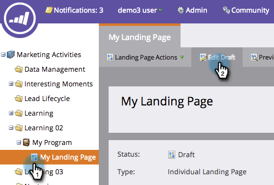

# Adición de un rectángulo a una página de aterrizaje de forma libre {#adding-a-rectangle-to-a-free-form-landing-page}

Los rectángulos en las páginas de aterrizaje son buenos para resaltar un área del texto.

1. Seleccione una página de aterrizaje de forma libre y haga clic en **Editar borrador**.

   

   >[!NOTE]
   >
   >El diseñador de páginas de aterrizaje de forma libre se abre en una nueva ventana.

1. Arrastre el cursor sobre **Rectángulo** Elemento.

   

1. Seleccione el rectángulo y utilice el **Hoja de propiedades** para realizar los cambios necesarios.

   >[!TIP]
   >
   >Puede mover y cambiar el tamaño del rectángulo arrastrando y soltando. Pruebe también las flechas del teclado. Sugerencia: pulse Mayús-Flecha para mover el rectángulo de 10 píxeles cada vez.

   

¡Felicidades! Ahora tiene la capacidad de crear rectángulos en sus páginas de aterrizaje de forma libre.
