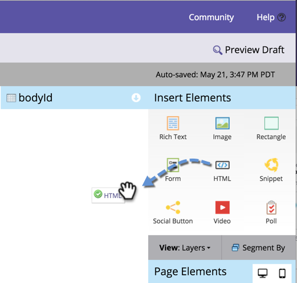

# Añadir un HTML personalizado a una página de destino de forma libre {#adding-custom-html-to-a-free-form-landing-page}

Puede agregar scripts personalizados, CSS u otros HTML a las páginas de aterrizaje.

>[!NOTE]
>
>La asistencia de Marketo Engage no está configurada para ayudar a solucionar problemas de HTML personalizado. Para obtener ayuda de HTML, consulte con un desarrollador web.

1. Seleccione la página de aterrizaje y haga clic en **[!UICONTROL Editar borrador]**.

   

1. En el editor de la página de aterrizaje, arrastre el elemento **HTML**.

   

1. Escriba su código personalizado de HTML y haga clic en **[!UICONTROL Guardar]**.

   

Puede agregar cualquier script o CSS al elemento HTML.

>[!TIP]
>
>Siempre que sea posible, pruebe la fuente de HTML personalizada en un entorno local antes de implementarla en una página de aterrizaje.

>[!CAUTION]
>
>Si el HTML personalizado no se está representando (como una función de JavaScript invisible o CSS), coloque el elemento en una ubicación memorable, como la parte superior izquierda. El contorno del elemento sólo está visible al hacer clic en su área.
