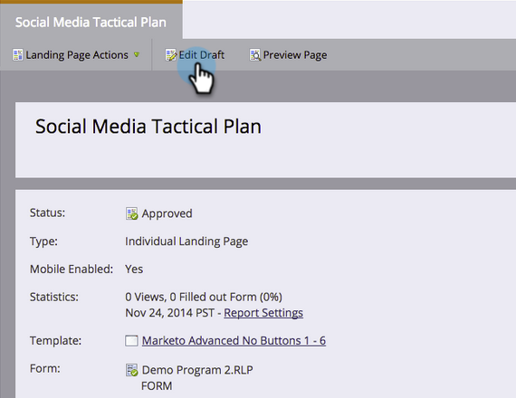
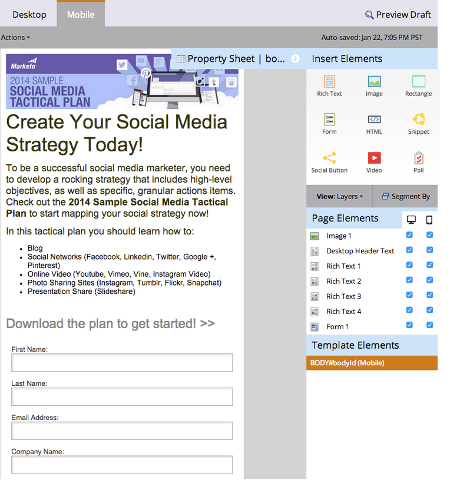
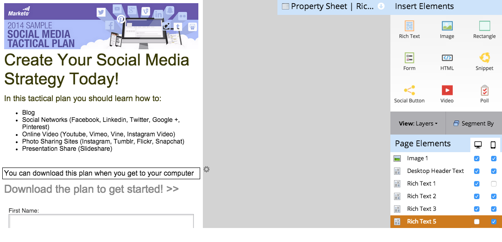
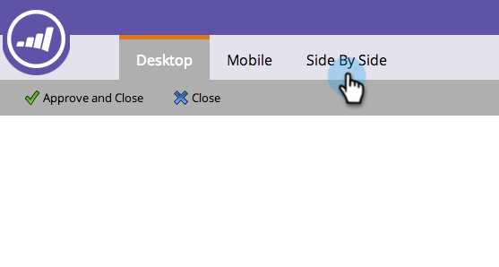
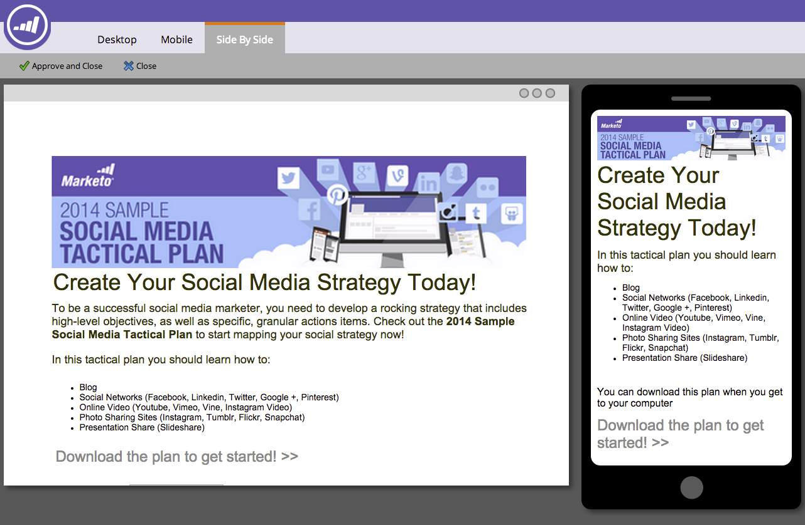

# Personalizar la vista móvil para la página de destino de forma libre {#customize-mobile-view-for-your-free-form-landing-page}

>[!PREREQUISITES]
>
>[Agregar una vista móvil para la página de aterrizaje de forma libre](/help/marketo/product-docs/demand-generation/landing-pages/free-form-landing-pages/add-a-mobile-view-for-your-free-form-landing-page.md)

La vista móvil de la página de aterrizaje de forma libre es generalmente automática, pero puede personalizarla.

1. Seleccione la página de aterrizaje de forma libre.

   

1. Haga clic en **[!UICONTROL Editar borrador]**.

   

1. Haga clic en la ficha **[!UICONTROL Móvil]**.

   

## Vista móvil frente a escritorio {#mobile-vs-desktop-view}

En Elementos de página, verá un icono  (escritorio) y un icono  (móvil). Esto le permite mostrar u ocultar diferentes elementos de forma dinámica.

De forma predeterminada, todo lo que hay en la vista de escritorio se muestra en la vista móvil.

>[!NOTE]
>
>Los rectángulos no se muestran en la vista móvil.

## Cosas importantes que saber {#important-things-to-know}

* Las imágenes se ampliarán a la anchura de su dispositivo móvil. Si desea imágenes más pequeñas, arrastre el elemento de texto enriquecido y añada la imagen desde allí.
* Utilice únicamente formularios Forms 2.0. Responden y se ajustan automáticamente.
* Solo se puede editar un elemento de plantilla, BODY#bodyid (Mobile). Puede usar esto para cambiar el color de fondo.

  

## Ocultar un elemento de la vista móvil {#hide-an-element-from-the-mobile-view}

>[!TIP]
>
>Menos es más en dispositivos móviles.

1. Para ocultar un elemento, haga clic en la casilla de verificación correspondiente de la columna móvil.

   

1. Ese elemento ya no estará visible en la vista móvil.

   

## Añadir un elemento a la vista móvil {#add-an-element-to-the-mobile-view}

>[!TIP]
>
>Reduzca el contenido para la vista móvil.

1. Para agregar un elemento, arrástrelo y suéltelo en la página de aterrizaje de forma libre.

   

   Asegúrese de que el elemento esté configurado para mostrarse solo en la vista móvil.

   

>[!TIP]
>
>La vista móvil también puede tener una organización diferente de los elementos de página. Mueva elementos en la página de aterrizaje de forma libre o reordene los objetos enumerados en **[!UICONTROL Elementos de página]** arrastrando y soltando.

## Vista previa para móviles {#preview-mobile-view}

1. Haga clic en **[!UICONTROL Vista previa del borrador]**.

   

1. Seleccione **[!UICONTROL Side By Side]** para comparar las versiones de escritorio y móvil al mismo tiempo.

   

1. Ahora puede ver las versiones de escritorio y móvil de las páginas de aterrizaje al mismo tiempo.

   

1. Haga clic en **[!UICONTROL Aprobar y cerrar]**.

   

   >[!NOTE]
   >
   >La vista previa no es interactiva. Cada smartphone muestra las cosas un poco diferente. Se recomienda previsualizar la página de aterrizaje en algunos dispositivos para ver exactamente cómo se comportará.

>[!MORELIKETHIS]
>
>[Hacer compatible una plantilla de página de aterrizaje de forma libre existente](/help/marketo/product-docs/demand-generation/landing-pages/landing-page-templates/make-an-existing-free-form-landing-page-template-mobile-compatible.md)
