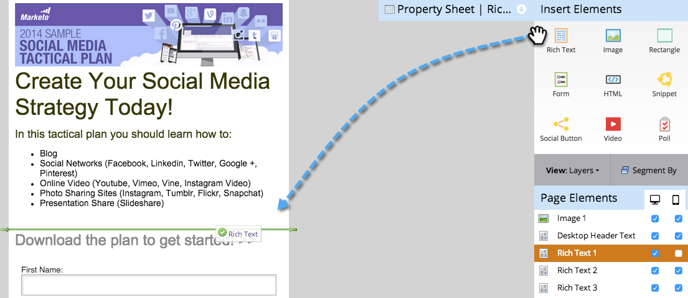
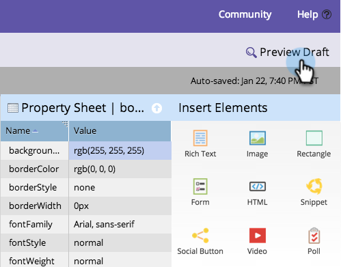

# Personalizar la vista móvil para la página de aterrizaje de forma libre {#customize-mobile-view-for-your-free-form-landing-page}

>[!PREREQUISITES]
>
>[Agregar una vista móvil para la página de aterrizaje de forma libre](/help/marketo/product-docs/demand-generation/landing-pages/free-form-landing-pages/add-a-mobile-view-for-your-free-form-landing-page.md)

La vista móvil de la página de aterrizaje de forma libre es principalmente automática, pero puede personalizarla. Así es como.

1. Seleccione la página de aterrizaje de forma libre.

   

1. Haga clic en **Editar borrador**.

   

1. Haga clic en el **Móvil** pestaña .

   

## Vista móvil frente a vista de escritorio {#mobile-vs-desktop-view}

En Elementos de página, verá una  icono (escritorio) y  (móvil). Esto le permite mostrar u ocultar distintos elementos de forma dinámica.

De forma predeterminada, todo en la vista de escritorio se muestra en la vista móvil.

>[!NOTE]
>
>Los rectángulos no se muestran en la vista móvil.

## Aspectos importantes a tener en cuenta: {#important-things-to-know}

* Las imágenes se ampliarán a la anchura del dispositivo móvil. Si desea imágenes más pequeñas, arrastre el elemento de texto enriquecido y añada la imagen desde allí.
* Utilice solo formularios de Forms 2.0. Son adaptables y se ajustan automáticamente.
* Solo se puede editar un elemento de plantilla, BODY#body (Mobile). Puede utilizarlo para cambiar el color de fondo.

   

## Ocultar un elemento de la vista móvil {#hide-an-element-from-the-mobile-view}

>[!TIP]
>
>Menos es más en móviles. Utilice menos palabras para los clientes más felices.

1. Para ocultar un elemento, haga clic en la casilla de verificación correspondiente en la columna móvil.

   

1. ¡Perfecto! Ese elemento ya no estará visible en la vista móvil.

   

## Añadir un elemento a la vista móvil {#add-an-element-to-the-mobile-view}

>[!TIP]
>
>Crear contenido especial (más corto) solo para la vista móvil.

1. Para agregar un elemento, arrástrelo y suéltelo en la página de aterrizaje de forma libre.

   

   Asegúrese de que el elemento esté configurado para mostrarse solo en la vista móvil.

   

>[!TIP]
>
>La vista móvil también puede tener una disposición diferente de elementos de página. Mueva o reordene los objetos que aparecen en la página de aterrizaje de forma libre **Elementos de página** mediante arrastrar y soltar.

## Vista previa de vista móvil {#preview-mobile-view}

1. Haga clic en **Previsualizar borrador**.

   

1. ¿Quieres ver algo genial? Select **Lado a lado**.

   

1. Ahora puede ver las versiones de escritorio y móviles de sus páginas de aterrizaje al mismo tiempo.

   

1. Si le encanta, haga clic en **Aprobar y cerrar**.

   

   >[!NOTE]
   >
   >La vista previa no es interactiva. Cada smartphone muestra las cosas un poco diferente. Se recomienda previsualizar la página de aterrizaje en algunos dispositivos para ver exactamente cómo se comportará la página de aterrizaje.

¡Diviértete!

>[!MORELIKETHIS]
>
>[Hacer compatible con Mobile una plantilla de página de aterrizaje de forma libre existente](/help/marketo/product-docs/demand-generation/landing-pages/landing-page-templates/make-an-existing-free-form-landing-page-template-mobile-compatible.md)
