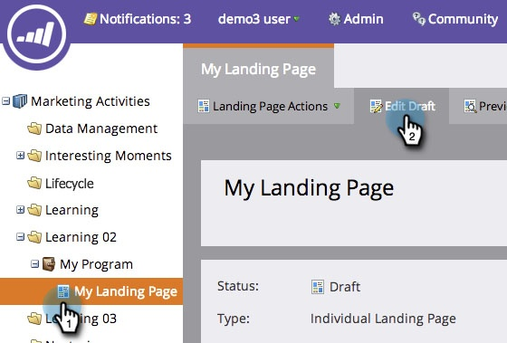

# Uso de contenido dinámico en una página de destino de forma libre {#use-dynamic-content-in-a-free-form-landing-page}

El uso de contenido dinámico en las páginas de destino hace que la audiencia se involucre con la información de destino.

>[!PREREQUISITES]
>
>* [Crear una segmentación](/help/marketo/product-docs/personalization/segmentation-and-snippets/segmentation/create-a-segmentation.md)
>* [Crear una página de aterrizaje de forma libre](/help/marketo/product-docs/demand-generation/landing-pages/free-form-landing-pages/create-a-free-form-landing-page.md)
>* [Agregar un nuevo formulario a una página de aterrizaje de forma libre](/help/marketo/product-docs/demand-generation/landing-pages/free-form-landing-pages/add-a-new-form-to-a-free-form-landing-page.md)

## Añadir segmentación {#add-segmentation}

1. Vaya a **[!UICONTROL Actividades de marketing]**.

   

1. Seleccione su página de aterrizaje y haga clic en **[!UICONTROL Editar borrador]**.

   

1. Haga clic en **[!UICONTROL Segmentar por]**.

   

1. Escriba el nombre de [!UICONTROL Segmentation] y haga clic en **[!UICONTROL Guardar]**.

   

1. Su segmentación y sus segmentos aparecen en [!UICONTROL Dinámico] a la derecha.

   

>[!NOTE]
>
>Todos los elementos de la página de aterrizaje son Estáticos de forma predeterminada.

## Hacer dinámico el elemento {#make-element-dynamic}

1. Arrastre y suelte los elementos de contenido dinámico de bajo **[!UICONTROL Estático]** a **[!UICONTROL Dinámico]**.

   

1. También puede hacer que los elementos **[!UICONTROL Estáticos]** o **[!UICONTROL Dinámicos]** procedan del elemento **[!UICONTROL Configuración]**.

   

## Aplicar contenido dinámico {#apply-dynamic-content}

1. Seleccione un elemento debajo de un segmento, haga clic en el icono de configuración y luego haga clic en **[!UICONTROL Editar]**. Repita el proceso para cada segmento.

   

1. Una marca de verificación verde indica el contenido específico de ese segmento. Un espacio en blanco indica el contenido de segmento predeterminado.

   

>[!CAUTION]
>
>Cambios en el bloque de contenido de segmento predeterminado: se aplica a todos los segmentos.

>[!TIP]
>
>Cree una página de aterrizaje predeterminada antes de modificar el contenido de los distintos segmentos.

¡Voila! Ahora puede enviar contenido de destino.

>[!MORELIKETHIS]
>
>* [Vista previa de una página de aterrizaje con contenido dinámico](/help/marketo/product-docs/demand-generation/landing-pages/landing-page-actions/preview-a-landing-page-with-dynamic-content.md)
>* [Uso de contenido dinámico en un correo electrónico](/help/marketo/product-docs/email-marketing/general/functions-in-the-editor/using-dynamic-content-in-an-email.md)
