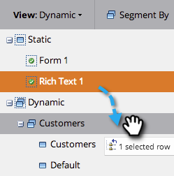
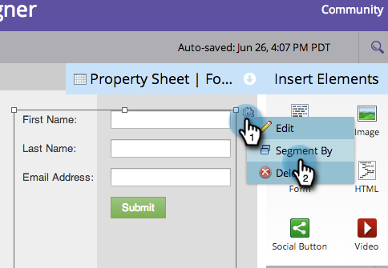

# Uso de contenido dinámico en una Página de aterrizaje de formato libre {#use-dynamic-content-in-a-free-form-landing-page}

El uso de contenido dinámico en Páginas de aterrizaje involucra a su audiencia con información de objetivo.

>[!NOTE]
>
>**Requisitos previos**
>
>* [Crear una segmentación](../../../../product-docs/personalization/segmentation-and-snippets/segmentation/create-a-segmentation.md)
>* [Creación de una Página de aterrizaje de forma libre](create-a-free-form-landing-page.md)
>* [Añadir un nuevo formulario en una Página de aterrizaje de forma libre](add-a-new-form-to-a-free-form-landing-page.md)

>

## Añadir segmentación {#add-segmentation}

1. Vaya a Actividades **de marketing**.

   

   Seleccione la Página de aterrizaje y, a continuación, haga clic en Editar borrador.

   

   Haga clic en Segmentar por.

   

   Introduzca el nombre de la segmentación y haga clic en Guardar.

   

   La segmentación y sus segmentos aparecen en Dinámica a la derecha.

   

>[!NOTE]
>
>Todos los elementos de página de aterrizaje son estáticos de forma predeterminada.

## Convertir elementos en dinámicos {#make-element-dynamic}

1. Arrastre y suelte los elementos de contenido dinámico desde debajo de **Estático** a **Dinámico.**

   

1. También puede hacer que los elementos sean **estáticos** o **dinámicos** desde la **configuración del elemento.**

   

## Aplicar contenido dinámico {#apply-dynamic-content}

1. Seleccione un elemento debajo de un segmento, haga clic en el icono de configuración y, a continuación, haga clic en **Editar**. Repita el proceso para cada segmento.

   

1. Una marca de verificación verde indica el contenido específico de ese segmento. Un espacio en blanco indica el contenido del segmento predeterminado.

   

>[!CAUTION]
>
>Los cambios en el bloque de contenido de segmento predeterminado se aplican a todos los segmentos.

>[!TIP]
>
>Cree una página de aterrizaje predeterminada antes de modificar el contenido de los distintos segmentos.

¡Voila! Ahora puede enviar contenido de destino.

>[!NOTE]
>
>**Artículos relacionados**
>
>* [Previsualización de una Página de aterrizaje con contenido dinámico](../../../../product-docs/demand-generation/landing-pages/landing-page-actions/preview-a-landing-page-with-dynamic-content.md)
>* [Uso de contenido dinámico en un correo electrónico](../../../../product-docs/email-marketing/general/functions-in-the-editor/using-dynamic-content-in-an-email.md)

>

