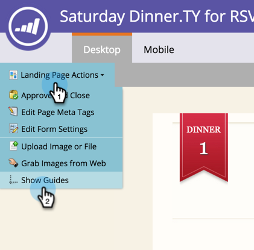
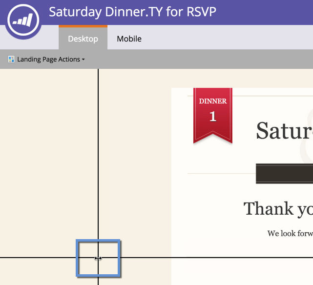
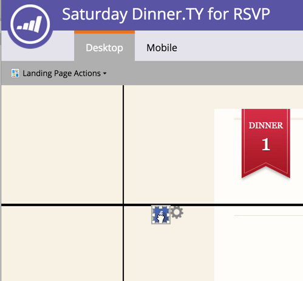

# Usar guías para el diseño de página de aterrizaje de forma libre {#use-guides-for-free-form-landing-page-design}

Al diseñar una página de aterrizaje de forma libre, puede utilizar las guías para ayudarle a alinear los componentes.

>[!NOTE]
>
>Las guías solo están disponibles en la **Forma libre** editor de páginas de aterrizaje.

1. Seleccione un **Página de aterrizaje** y haga clic en **Editar borrador**.

   

1. Haga clic en **Acciones de página de aterrizaje** y seleccione **Mostrar guías**.

   

1. Sobre el lienzo aparecerá una guía vertical u horizontal. Utilice el cursor para moverlos.

   

1. Arrastre un objeto sobre la línea. Se suelta cuando la línea se duplica en anchura y el objeto se ajusta a la guía.

   

   ¡Los objetos alineados son fáciles de ver!
