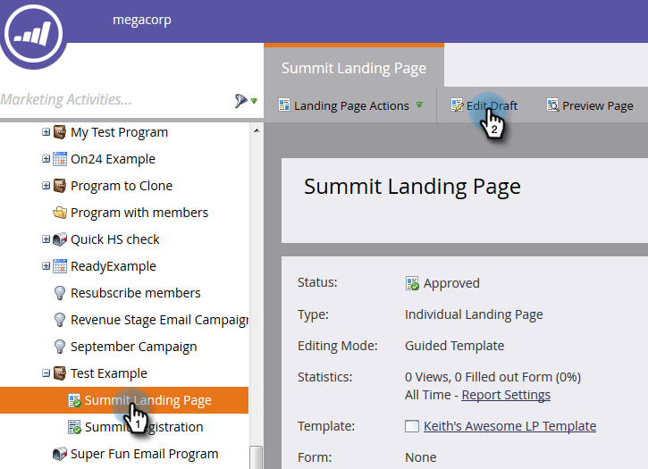
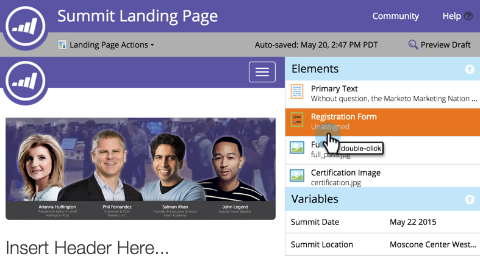

# Agregar un formulario a una página de aterrizaje guiada {#add-a-form-to-a-guided-landing-page}

Formulario, cumpla la página de aterrizaje. página de aterrizaje, cumplimente el formulario.

>[!PREREQUISITES]
>
>[Crear una página de aterrizaje guiada](/help/marketo/product-docs/demand-generation/landing-pages/guided-landing-pages/create-a-guided-landing-page.md)

1. Vaya a la **Actividades de marketing** .

   

1. Busque y seleccione la página de aterrizaje y haga clic en **Editar borrador**.

   

   >[!NOTE]
   >
   >La plantilla define los elementos disponibles en las páginas de aterrizaje guiadas. Si no ve un formulario en el panel de elementos, seleccione una plantilla nueva o hable con el creador de plantillas.

1. Haga doble clic en el botón **Formulario** en el panel elemento .

   

1. Seleccione el formulario que desee agregar.

   

1. Tiene tres opciones al elegir la página de seguimiento:

   * Página de aterrizaje: elija una página de aterrizaje de Marketo
   * Dirección URL externa: elija la dirección URL que desee
   * Formulario definido : utilice la configuración definida en el nivel de formulario

   >[!NOTE]
   >
   >La página de seguimiento es la página que verán los usuarios después de enviar el formulario.

1. En este ejemplo utilizaremos Formulario definido. Haga clic en **Insertar**.

   

   ¡Bien hecho!

   

A continuación, cierre el editor de páginas de aterrizaje y [aprobar el borrador de la página de aterrizaje](/help/marketo/product-docs/demand-generation/landing-pages/understanding-landing-pages/approve-unapprove-or-delete-a-landing-page.md).
