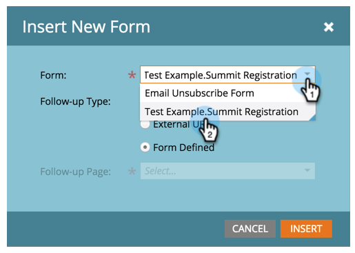
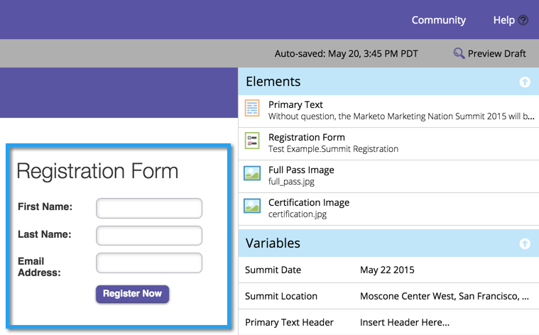

# Añadir un formulario a una página de destino guiada {#add-a-form-to-a-guided-landing-page}

>[!PREREQUISITES]
>
>[Crear una página de aterrizaje guiada](/help/marketo/product-docs/demand-generation/landing-pages/guided-landing-pages/create-a-guided-landing-page.md)

1. Vaya al área **[!UICONTROL Actividades de marketing]**.

   

1. Busque y seleccione su página de aterrizaje y haga clic en **[!UICONTROL Editar borrador]**.

   

   >[!NOTE]
   >
   >La plantilla define los elementos disponibles en las páginas de aterrizaje guiadas. Si no ve un formulario en el panel Elementos, seleccione una plantilla nueva o hable con el creador de la plantilla.

1. Haga doble clic en **Formulario** en el panel de elementos.

   

1. Seleccione el formulario que desee agregar.

   

1. Tiene tres opciones al elegir la página de seguimiento:

   * **[!UICONTROL Página de aterrizaje]**: elija una página de aterrizaje de Marketo
   * **[!UICONTROL Dirección URL externa]**: elija la dirección URL que desee
   * **[!UICONTROL Formulario definido]**: use la configuración definida a nivel de formulario

   >[!NOTE]
   >
   >La página de seguimiento es la página que verán los usuarios después de enviar el formulario.

1. En este ejemplo, seleccione [!UICONTROL Formulario definido]. Haga clic en **[!UICONTROL Insertar]**.

   

   

Cierre el editor de páginas de aterrizaje y [apruebe el borrador de la página de aterrizaje](/help/marketo/product-docs/demand-generation/landing-pages/understanding-landing-pages/approve-unapprove-or-delete-a-landing-page.md).
