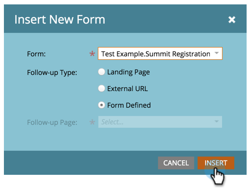

# Añadir un formulario a una Página de aterrizaje guiada {#add-a-form-to-a-guided-landing-page}

Formulario, cumple con la página de aterrizaje. Página de aterrizaje, cumplimentar formulario.

>[!PREREQUISITES]
>
>* [Creación de una Página de aterrizaje guiada](create-a-guided-landing-page.md)

>

1. Vaya al área **Actividades de mercadotecnia**.

   

1. Busque y seleccione su página de aterrizaje y haga clic en **Editar borrador**.

   

   >[!NOTE]
   >
   >Los elementos disponibles en las páginas de aterrizaje guiadas se definen mediante la plantilla. Si no ve ningún formulario en el panel Elementos, seleccione una plantilla nueva o póngase en contacto con el creador de la plantilla.

1. Haga clic con el doble en el **Formulario** del panel de elementos.

   

1. Seleccione el formulario que desee agregar.

   

1. Tiene tres opciones al elegir la página de seguimiento:

   * página de aterrizaje: elija una página de aterrizaje de marketing
   * Dirección URL externa: elija la dirección URL que desee
   * Formulario definido: utilice la configuración definida en el nivel de formulario

   >[!NOTE]
   >
   >La página de seguimiento es la página que verán los usuarios después de enviar el formulario.

1. En este ejemplo usaremos Formulario definido. Haga clic en **Insertar**.

   

   ¡Bien hecho!

   

Ahora cierre el editor de páginas de aterrizaje y [apruebe el borrador de página de aterrizaje](../../../../product-docs/demand-generation/landing-pages/understanding-landing-pages/approve-unapprove-or-delete-a-landing-page.md).
