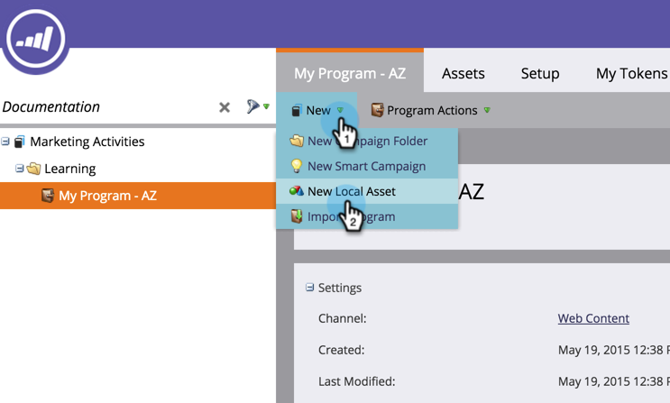

# Crear una página de aterrizaje guiada {#create-a-guided-landing-page}

>[!NOTE]
>
>Los modos de página de aterrizaje se definen mediante su plantilla. [Más información](/help/marketo/product-docs/demand-generation/landing-pages/understanding-landing-pages/understanding-free-form-vs-guided-landing-pages.md) acerca de las plantillas de página de aterrizaje guiadas y de formularios libres.

>[!PREREQUISITES]
>
>Para utilizar una plantilla personalizada, primero debe [crear una plantilla de página de aterrizaje guiada](/help/marketo/product-docs/demand-generation/landing-pages/landing-page-templates/create-a-guided-landing-page-template.md).

## Creación de una página de aterrizaje guiada en un programa {#create-a-guided-landing-page-in-a-program}

Las páginas de aterrizaje guiadas se pueden crear como recursos locales de un programa o en Design Studio para su uso global.

1. Vaya a **Actividades de marketing**.

   

1. Seleccione el programa.

   

1. Haga clic en el **Nuevo** lista desplegable. Select **Nuevo recurso local**.

   

1. Select **Página de aterrizaje**.

   

1. Asigne un nombre a la página de aterrizaje. Haga clic en el **Plantilla** y seleccione **Plantilla guiada**.

   >[!NOTE]
   >
   >Las plantillas de página de aterrizaje guiadas tienen la variable  junto a ellos. Las plantillas guiadas están estructuradas de modo que puedan permanecer totalmente adaptables.

   

## Creación de una página de aterrizaje en Design Studio {#create-a-landing-page-in-design-studio}

1. Vaya a **Design Studio**.

   

1. Haga clic en el **Nuevo** lista desplegable. Select **Nueva página de aterrizaje**.

   

1. Asigne un nombre a la página de aterrizaje. Haga clic en el **Plantilla** y seleccione **Plantilla guiada**.

   

1. Haga clic en **Crear**.

   

>[!TIP]
>
>La dirección URL se crea automáticamente a partir de los nombres de programa y de página de aterrizaje. Para cambiar la dirección URL, edite la **Dirección URL de la página** campo .
>
>Borre la variable **Abrir en editor** casilla de verificación si no desea que el editor se abra inmediatamente después de hacer clic en **Crear**.
