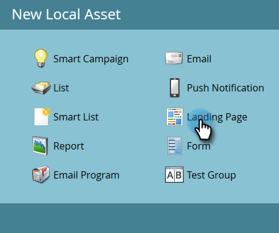
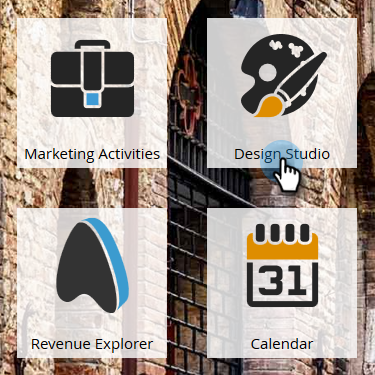
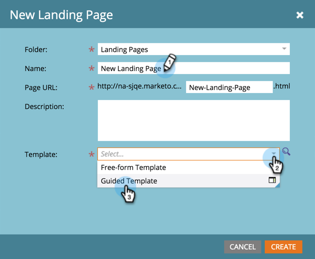
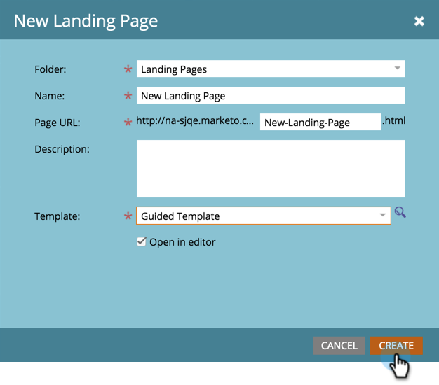

# Creación de una página de destino guiada {#create-a-guided-landing-page}

>[!NOTE]
>
>Los modos de página de aterrizaje se definen mediante su plantilla. [Más información](/help/marketo/product-docs/demand-generation/landing-pages/understanding-landing-pages/understanding-free-form-vs-guided-landing-pages.md) acerca de las plantillas de página de aterrizaje guiada y de forma libre.

>[!PREREQUISITES]
>
>Para usar una plantilla personalizada, primero debe [crear una plantilla de página de aterrizaje guiada](/help/marketo/product-docs/demand-generation/landing-pages/landing-page-templates/create-a-guided-landing-page-template.md).

## Creación de una página de aterrizaje guiada en un programa {#create-a-guided-landing-page-in-a-program}

Las páginas de aterrizaje guiadas se pueden crear como recursos locales de un programa o en [!UICONTROL Design Studio] para su uso global.

1. Vaya a **[!UICONTROL Actividades de marketing]**.

   

1. Seleccione el programa.

   

1. Haga clic en la lista desplegable **[!UICONTROL Nuevo]**. Seleccione **[!UICONTROL Nuevo recurso local]**.

   

1. Seleccione **[!UICONTROL Página de aterrizaje]**.

   

1. Asigne un nombre a la página de aterrizaje. Haga clic en la lista desplegable **[!UICONTROL Plantilla]** y seleccione **[!UICONTROL Plantilla guiada]**.

   >[!NOTE]
   >
   >Las plantillas de página de aterrizaje guiada tienen el icono  junto a ellas. Las plantillas guiadas están estructuradas para que puedan seguir siendo totalmente adaptables.

   

## Creación de una página de aterrizaje en Design Studio {#create-a-landing-page-in-design-studio}

1. Vaya a **[!UICONTROL Design Studio]**.

   

1. Haga clic en la lista desplegable **[!UICONTROL Nuevo]**. Seleccione **[!UICONTROL Nueva página de aterrizaje]**.

   

1. Asigne un nombre a la página de aterrizaje. Haga clic en la lista desplegable **[!UICONTROL Plantilla]** y seleccione **[!UICONTROL Plantilla guiada]**.

   

1. Haga clic en **[!UICONTROL Crear]**.

   

>[!TIP]
>
>La dirección URL se construye automáticamente a partir de los nombres de programa y página de aterrizaje. Para cambiar la URL, edite el campo **[!UICONTROL URL de la página]**.
>
>Desactive la casilla de verificación **[!UICONTROL Abrir en editor]** si no desea que el editor se abra inmediatamente después de hacer clic en **[!UICONTROL Crear]**.
