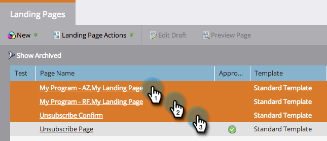

# Aprobar varias páginas de aterrizaje a la vez {#approve-multiple-landing-pages-at-once}

1. Ir a **Design Studio**.

   

1. Clic **Páginas de aterrizaje**.

   

1. Mantenga presionada la tecla Ctrl (Windows) o Comando (Mac) y haga clic para seleccionar varias páginas de aterrizaje.

   

   >[!TIP]
   >
   >No haga clic en el nombre real de la página de aterrizaje, ya que son vínculos y le llevarán a la propia página.

1. Con las páginas de aterrizaje seleccionadas, vaya a **Acciones de página de aterrizaje** y haga clic en **Aprobar**.

   

   ¡Ahí tienes! Ahora puede aprobar varias páginas de aterrizaje de forma rápida y sencilla.

   

   >[!TIP]
   >
   >También puede seguir los pasos anteriores para otras opciones masivas, como desaprobar o eliminar.
