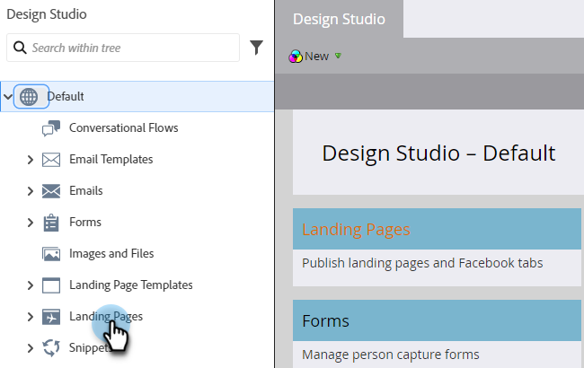

# Aprobar varias páginas de destino a la vez {#approve-multiple-landing-pages-at-once}

1. Vaya a **[!UICONTROL Design Studio]**.

   

1. Haga clic en **[!UICONTROL Páginas de aterrizaje]**.

   

1. Seleccione las páginas de aterrizaje que desee.

   

   >[!TIP]
   >
   >No haga clic en el nombre real de la página de aterrizaje, ya que son vínculos y le llevarán a la propia página.

1. Con las páginas de aterrizaje seleccionadas, haga clic en el menú desplegable **Acciones de página de aterrizaje** y seleccione **Aprobar**.

   

1. Haga clic en **Aprobar**.

   

   >[!TIP]
   >
   >También puede seguir los pasos anteriores para otras opciones masivas, como desaprobar o eliminar.
