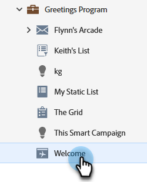
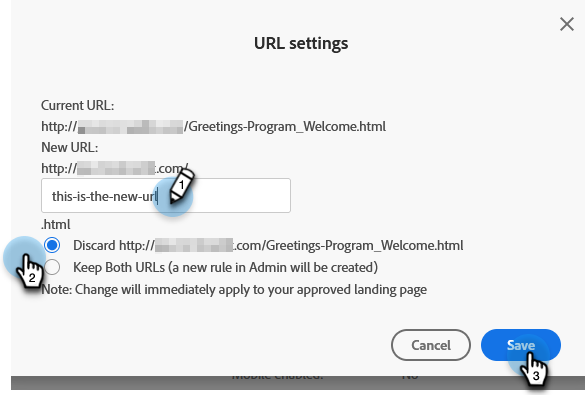

# Cambio de la URL de la página de destino {#change-the-landing-page-url}

Puede modificar la dirección URL de una página de aterrizaje. Esto puede ayudar a que la URL sea más fácil de recordar y mejorar la SEO.

1. Busque y seleccione la página de aterrizaje que desee.

   

1. Haga clic en el menú desplegable **Acciones de página de aterrizaje**, desplácese hasta **Herramientas de URL** y seleccione **Configuración de URL**.

   

1. Escriba la **[!UICONTROL URL nueva]**, elija que se descarte o se redirija la URL antigua y haga clic en **[!UICONTROL Guardar]**.

   

   >[!NOTE]
   >
   >Si decide mantener ambas direcciones URL, se creará automáticamente una regla de redirección. Más información sobre [redirecciones de URL](/help/marketo/product-docs/demand-generation/landing-pages/personalizing-landing-pages/redirect-a-url-path.md).
