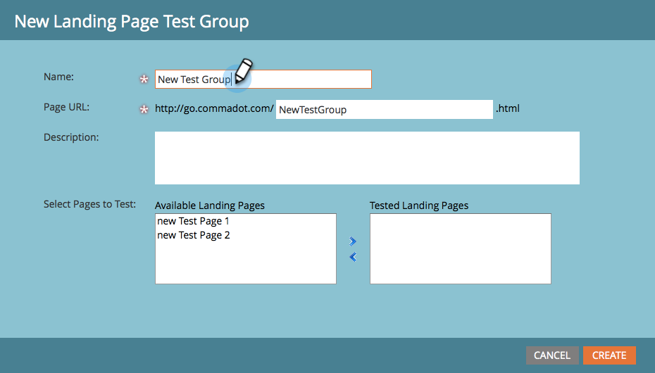

# Clonación de un grupo de prueba de página de aterrizaje {#cloning-a-landing-page-test-group}

Desde [!UICONTROL Design Studio], puede encontrar y duplicar un grupo de prueba de página de aterrizaje.

1. Haga clic con el botón derecho en una página no aprobada. Seleccionar **[!UICONTROL clonar]**.

   

1. Asigne un nuevo **[!UICONTROL Nombre]** a esta página clonada. Las páginas clonadas aparecen al final de la carpeta actual.

   

1. Ahora cree un nuevo grupo de prueba haciendo clic en **[!UICONTROL Nuevo]** y seleccionando **[!UICONTROL Nuevo grupo de prueba]**.

   

1. En el cuadro de diálogo Crear nuevas páginas de aterrizaje, escriba el nuevo grupo de prueba **[!UICONTROL Name]**.

   

1. En la parte inferior del cuadro de diálogo, seleccione las páginas clonadas en la lista **[!UICONTROL Páginas de aterrizaje disponibles]** y haga clic en la flecha que señala a la derecha para incluirla en las **[!UICONTROL Páginas de aterrizaje probadas]**. Haga esto para todas las páginas de aterrizaje que desee en este grupo.

   

1. Cuando haya terminado, haga clic en **[!UICONTROL Crear]**.

   

1. Cuando esté listo para iniciar el grupo de prueba, haga clic con el botón secundario en el grupo del árbol y elija **[!UICONTROL Aprobar grupo de prueba]**.

   

   El grupo ahora realizará un seguimiento activo de las visitas y finalizaciones de formularios para que pueda ver qué página de aterrizaje está teniendo el mejor rendimiento.
