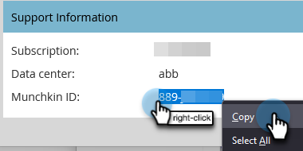

# Personalización de las direcciones URL de su página de aterrizaje con un CNAME {#customize-your-landing-page-urls-with-a-cname}

Aunque Marketo aloja sus páginas de aterrizaje, la dirección URL se puede personalizar completamente. Aspecto sin un CNAME:

`https://na-sj02.marketo.com/lp/mktodemoaccount126/UnsubscribePage.html`

El aspecto que debería tener:

`https://go.YourCompany.com/UnsubscribePage.html`

## Elija un CNAME {#choose-a-cname}

Elija una palabra para ir al principio de la dirección URL de sus páginas de aterrizaje. Es solo una palabra y debería ser relativamente corta. Ejemplos:

* go.YourCompany.com/NameOfPage.html
* info.YourCompany.com/NameOfPage.html
* pages.YourCompany.com/NameOfPage.html

La única palabra (más YourCompany.com) se llama CNAME. Lo necesitarás más tarde, así que toma nota.

## Búsqueda de su ID de Munchkin {#find-your-munchkin-id}

1. Vaya al área de **Admin**.

   

1. Haga clic en **Mi cuenta**.

   

   >[!NOTE]
   >
   >**Se requieren permisos de administración**

1. Desplácese hacia abajo hasta &quot;Información de asistencia&quot; y copie su ID de Munchkin.

   

## Enviar solicitud a TI {#send-request-to-it}

Pida al personal de TI que configure el siguiente CNAME: (Reemplace la palabra [CNAME] y [Munchkin ID] con el texto del paso anterior).

[CNAME].YourCompany.com > [ID de Munchkin].mktoweb.com

## Configuración completa de CNAME {#complete-cname-setup}

1. Una vez que el equipo de TI haya creado el CNAME, vaya al área de **Admin**.

   

1. Haga clic en **Páginas de aterrizaje**.

   

1. En la sección **Configuración**, haga clic en **Editar**.

   

1. Escriba su CNAME en **Nombre de dominio para páginas de aterrizaje**, ingrese su **página de reserva**, ingrese su **página principal** y haga clic en **Guardar**.

   

>[!NOTE]
>
>Su página de reserva será la página a la que se redirigirán los posibles clientes si la página de aterrizaje de Marketo no está disponible.

¡Buen trabajo! Las páginas de aterrizaje ahora están etiquetadas con el dominio de la compañía.
