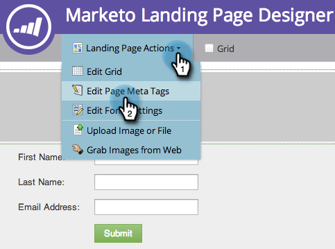

# Editar el título y los metadatos de la página de aterrizaje {#edit-landing-page-title-and-metadata}

Marketo le permite editar su página de aterrizaje [metaetiquetas con fines de SEO](https://www.w3schools.com/tags/tag_meta.asp) además de personalizar el `<head>` del HTML.

1. Seleccione una página de aterrizaje y haga clic en **Editar borrador**.

   

   >[!NOTE]
   >
   >El diseñador de páginas de aterrizaje se abrirá en una nueva ventana.

1. En **Acciones de página de aterrizaje**, haga clic en **Editar etiquetas de metadatos de página**.

   

1. Introduzca la variable **Título**, **Palabras clave** y **Descripción** para su página. Seleccione el **Robots** e introduzca el contenido personalizado que desee para el HTML `<head>` para obtener más información. Haga clic en **Guardar**.

   

   >[!TIP]
   >
   >**Qué hace [robots](https://www.robotstxt.org/meta.html) ¿quieres decir?**
   >
   >**index**: se puede buscar en la web. **seguir**: los motores de búsqueda pueden seguir vínculos en páginas indexadas.

1. Edite las etiquetas en cualquier momento y apruebe la página de aterrizaje.
