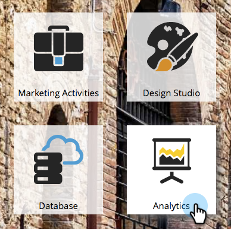
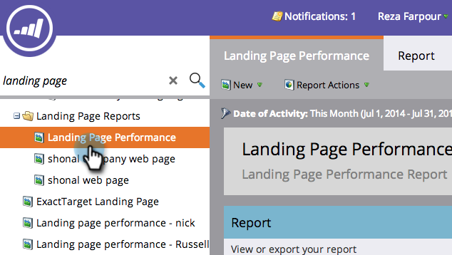

# Filtrado de un informe de rendimiento de la página de destino {#filter-a-landing-page-performance-report}

Enfoque su [informe de rendimiento de la página de aterrizaje](/help/marketo/product-docs/demand-generation/landing-pages/understanding-landing-pages/landing-page-performance-report.md) en las páginas de aterrizaje de sus programas (recursos locales), en las de [!UICONTROL Design Studio] (recursos globales) o en las que se han archivado.

1. Vaya a **[!UICONTROL Analytics]** (o a **[!UICONTROL Actividades de marketing]**).

   

1. Seleccione el informe de página de aterrizaje en el árbol de navegación.

   

1. Haga clic en la ficha **[!UICONTROL Configuración]** y arrastre un filtro.

   

   * **[!UICONTROL Páginas de aterrizaje de Design Studio]:** Recursos globales, administrados en [!UICONTROL Design Studio].
   * **[!UICONTROL Páginas de aterrizaje de actividades de marketing]:** Recursos locales en programas en la ficha [!UICONTROL Actividades de marketing].
   * **[!UICONTROL Páginas de aterrizaje archivadas]:** Páginas de aterrizaje retiradas e inactivas.

1. Elija las carpetas y las páginas de aterrizaje específicas que desea incluir en el informe.

   

   >[!TIP]
   >
   >Si selecciona una carpeta, el informe incluirá todo lo que la carpeta contenga en el momento en que se ejecute el informe.

1. ¡Ya terminaste! Haga clic en la ficha **[!UICONTROL Informe]** para ver el informe filtrado.

   
